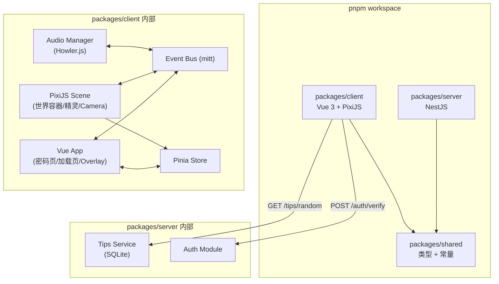

# P0 Engineering Base Design

## Background & Motivation

"果果的秘密空间"已完成 4 个 Spike 验证（PixiJS+Rive 集成、Canvas+Vue 覆盖层通信、Camera 双模式、美术管线），技术方案可行性已确认。现需将 spike 验证代码升级为可扩展的生产工程结构，作为后续所有功能迭代的地基。

## Goal

- 搭建 pnpm workspace monorepo，client/server/shared 可独立构建且类型共享
- 实现 PixiJS 场景渲染 + Camera 系统 + 密码认证 + 音频框架的完整首屏流程
- 首屏资源 ≤ 1.5MB，场景帧率 ≥ 55fps

## Non-Goal

- 不实现具体功能区域内容（地图、相册、日记等留给 P1+）
- 不搭建管理后台（P1.4 再做）
- 不实现猫动画行为树（P5）
- 不实现四季/节日装饰系统（P3+）
- 不做 CI/CD 流水线（后续按需添加）

## Architecture



### 数据流：首屏完整路径

```
用户访问 → 检查 localStorage JWT
  ├─ 有效 → 跳过密码页 → 资源加载 → 开门动画 → 场景渲染
  └─ 无/过期 → 密码页 → POST /auth/verify → JWT → 资源加载 → 开门动画 → 场景渲染
```

### 场景渲染层级

```
Stage (PixiJS)
└── World Container (scale + position = Camera)
    ├── Background Sprite (房间底图)
    ├── Props Container (装饰物)
    ├── Hotspots Container (可交互热区)
    └── (future) Cats / Particles / etc.
```

### Canvas + DOM 分层

```
z-index 层叠：
  0: <canvas> (PixiJS 场景)
  10: Vue Overlay (返回按钮、导航指示器)
  20: Vue Panel (弹窗/面板内容)
  30: Vue Global UI (密码页、加载页)
```

## Interface Contract

### Auth API

#### POST /auth/verify

验证密码，返回 JWT。

**Request:**
```typescript
interface AuthVerifyRequest {
  password: string
}
```

**Response 200:**
```typescript
interface AuthVerifyResponse {
  token: string    // JWT, 有效期 7 天
  role: 'owner' | 'visitor'
}
```

**Response 401:**
```typescript
interface AuthErrorResponse {
  message: string  // "密码不对哦"
}
```

**Response 429:**
```typescript
interface RateLimitResponse {
  message: string  // "休息一下再试吧"
  retryAfter: number  // 剩余等待秒数
}
```

#### GET /tips/random

获取随机加载小贴士。

**Response 200:**
```typescript
interface TipResponse {
  text: string  // "你知道吗？果果3岁时学会了骑车！"
}
```

### Client Modules

#### SceneManager

```typescript
interface SceneManager {
  /** 初始化 PixiJS，挂载到 canvas 元素 */
  init(canvas: HTMLCanvasElement): Promise<void>
  /** 销毁场景，释放资源 */
  destroy(): void
}
```

#### CameraController

```typescript
interface CameraController {
  /** 推进到指定区域 */
  zoomIn(zoneId: string): Promise<void>
  /** 回到全景 */
  zoomOut(): Promise<void>
  /** 竖屏滑动切换 */
  swipeTo(direction: 'left' | 'right'): void
  /** 当前状态 */
  readonly state: CameraState
}

interface CameraState {
  mode: 'overview' | 'zoomed'
  currentZoneId: string | null
  scale: number
  isTransitioning: boolean
}

interface ZoneDefinition {
  id: string
  label: string
  /** 在 960×540 世界坐标系中的位置和尺寸 */
  bounds: { x: number; y: number; w: number; h: number }
}
```

#### AudioManager

```typescript
interface AudioManager {
  /** 初始化音频系统（在用户首次交互后调用） */
  unlock(): void
  /** 注册音效资源 */
  registerSfx(id: string, src: string): void
  /** 播放环境音（循环，淡入） */
  playAmbient(season: 'spring' | 'summer' | 'autumn' | 'winter'): void
  /** 播放一次性音效，资源不可用时静默跳过并返回 false */
  playSfx(id: string): boolean
  /** 停止所有音频 */
  stopAll(): void
  /** 是否已解锁 */
  readonly unlocked: boolean
}
```

**错误处理：**
- 音频资源加载失败：`playSfx` 返回 `false`，`playAmbient` 静默跳过，均不抛异常
- Audio Context 未解锁时调用播放：忽略调用，不抛异常

#### LoadingOrchestrator

```typescript
interface LoadingOrchestrator {
  /** 开始加载首屏资源，onProgress 回调进度 0-1 */
  loadAssets(onProgress: (progress: number) => void): Promise<void>
  /** 播放开门动画（GSAP timeline，含吱呀音效），返回动画完成 Promise */
  playDoorAnimation(): Promise<void>
  /** 超时时间（ms） */
  readonly timeout: number  // 15000
}
```

**错误处理：**
- 资源加载超时（15s）：reject Promise，上层显示重试提示
- 单个非关键资源加载失败：跳过继续，不阻塞整体流程
- 网络完全不可达：reject Promise，上层显示网络异常提示

#### AuthStore (Pinia)

```typescript
interface AuthState {
  token: string | null
  role: 'owner' | 'visitor' | null
  isAuthenticated: boolean
}

interface AuthActions {
  verify(password: string): Promise<{ success: boolean; message?: string; retryAfter?: number }>
  checkExisting(): boolean  // 检查 localStorage 中的 token
  logout(): void
}
```

## Data Model

### Server — SQLite (Prisma)

```prisma
model Config {
  key   String @id
  value String
  // 存储：owner_password_hash, visitor_password_hash
}

model Tip {
  id   Int    @id @default(autoincrement())
  text String
}
```

> 注：Rate limit 使用内存方案（Map + 定时清理），不存入数据库。单实例部署下内存方案简单高效，重启清零反而合理。

### Client — Zone Registry

```typescript
// packages/client/src/pixi/zones.ts
const ZONES: ZoneDefinition[] = [
  { id: 'wall', label: '墙面区', bounds: { x: 0, y: 0, w: 480, h: 300 } },
  { id: 'shelf', label: '书架区', bounds: { x: 480, y: 0, w: 240, h: 350 } },
  { id: 'desk', label: '书桌区', bounds: { x: 480, y: 200, w: 250, h: 340 } },
  { id: 'window', label: '窗户区', bounds: { x: 720, y: 0, w: 240, h: 350 } },
  { id: 'game', label: '游戏区', bounds: { x: 0, y: 300, w: 400, h: 240 } },
]
```

## Non-Functional Requirements

| 维度 | 指标 |
|------|------|
| 性能 | 首屏资源 ≤ 1.5MB (gzipped)；场景帧率 ≥ 55fps (中等配置)；Camera 动画无掉帧 |
| 响应时间 | 密码校验 P95 ≤ 200ms；场景首次渲染 ≤ 3s（fast 3G） |
| 安全 | 密码 bcrypt hash (cost=10)；JWT HS256 签名；Rate limit 10次/5分钟/IP |
| 兼容性 | Chrome 90+, Safari 15+, Firefox 90+, iOS 15+, Android 10+ |
| 可用性 | WebGL 不可用时显示降级提示；音频加载失败静默降级 |

## Alternatives Considered

| 方案 | 优点 | 缺点 | 不选原因 |
|------|------|------|---------|
| Rate limit 用 SQLite 表 | 持久化重启不丢失 | 每次请求读写 DB，需清理过期记录 | 单实例部署，内存 Map 简单高效，重启清零反而合理 |
| Camera 用 CSS transform 替代 PixiJS 容器缩放 | 实现简单 | Spike 3 验证会导致像素模糊 | Spike 已确认 PixiJS 内部 camera 效果更优 |
| JWT 换成 session cookie | 自动携带，防 XSS | 需 CSRF 防护，移动端 webview 兼容性不一 | 纯 SPA + Bearer token 更简单，且仅面向熟人使用无高安全需求 |
| 环境音用 Web Audio API 原生 | 无依赖 | 多轨管理、audio sprite、淡入淡出需手写大量代码 | Howler.js 10KB 覆盖全部需求 |

## Testing Strategy

| 测试对象 | 层级 | 关键用例 |
|---------|------|---------|
| AuthModule (密码校验、Rate limit) | 集成 | 正确密码返回 JWT；错误密码返回 401；超限返回 429；过期窗口重置 |
| LoadingOrchestrator (加载、超时、开门) | 集成 | 正常加载触发 onProgress 0→1；超时 15s reject；开门动画完成 resolve |
| SceneManager (初始化、销毁) | 集成 | Canvas 创建成功；底图加载渲染；destroy 释放资源 |
| CameraController (zoom-in/out) | 单元 | zoomIn 设置正确 scale/position；zoomOut 恢复初始值；transitioning 状态正确 |
| AudioManager (解锁、播放) | 单元 | unlock 后 unlocked=true；playSfx 调用 Howler play 返回 true；资源不存在时 playSfx 返回 false 不抛异常 |
| AuthStore (Pinia) | 单元 | verify 成功存 token；checkExisting 检测有效 JWT；过期 token 被清除 |
| 响应式适配 (letterbox) | 集成 | 1920×1080 窗口: world.scale = 2.0, world.x = 0, world.y = 0；800×600 窗口: scale = min(800/960, 600/540)；竖屏 zoomIn 后显示导航指示器 |
| E2E: 首屏完整流程 | E2E | 密码页→输入→加载→开门→场景可见 |

## Milestones

| 阶段 | 产出 | 依赖 |
|------|------|------|
| M0.1 Monorepo 搭建 | pnpm workspace + 三包结构 + TypeScript + ESLint | 无 |
| M0.2 场景基座 + 音频 | PixiJS 渲染 + Howler.js + 自定义光标 + Pinia/mitt | M0.1 |
| M0.3 Camera 系统 | zoom-in/out + 横竖屏适配 + 性能优化 | M0.2 |
| M0.4 入口与密码 | NestJS Auth + 密码页 + 加载页 + 开门动画 | M0.1 (server), M0.2 (client) |
