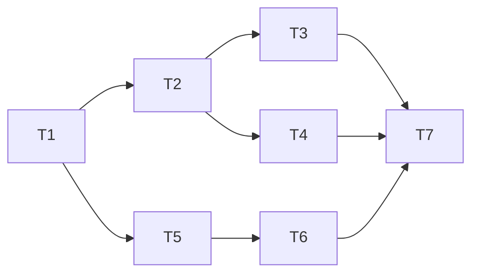

# P0 Engineering Base

**Branch:** feat/p0-engineering-base
**Baseline SHA:** a9b08c5
**Worktree Path:** /home/yangyang/workspace/codes/YoungerYang/secret-space
**Started At:** 2026-06-21T23:26:41+08:00
**Updated At:** 2026-06-21T23:26:41+08:00

**Goal:** 搭建 monorepo + PixiJS 场景 + Camera 系统 + 密码认证 + 音频框架，交付完整首屏流程
**Architecture:** pnpm workspace 三包（client/server/shared），client 用 Vue 3 + PixiJS + GSAP + Howler.js，server 用 NestJS + Prisma + SQLite，通过 mitt 事件总线协调 Canvas 与 DOM 层
**Tech Stack:** pnpm, Vue 3, Vite, PixiJS v8, GSAP, Howler.js, mitt, Pinia, NestJS, Prisma, SQLite, bcrypt, jsonwebtoken

## Dependency Graph



| Task | 依赖 | 可并行组 |
|------|------|---------|
| T1: Monorepo 搭建 | 无 | A |
| T2: PixiJS 场景基座 | T1 | B |
| T3: Camera 系统 | T2 | C |
| T4: 音频系统 | T2 | C |
| T5: NestJS 后端基座 | T1 | B |
| T6: 密码认证 API | T5 | C |
| T7: 入口流程集成 | T3, T4, T6 | D |

---

### Task 1: Monorepo 搭建

**Depends on:** 无

**Files:**
- Create: `pnpm-workspace.yaml`
- Create: `package.json` (root)
- Create: `.npmrc`
- Create: `packages/shared/package.json`
- Create: `packages/shared/src/index.ts`
- Create: `packages/shared/tsconfig.json`
- Create: `packages/client/package.json`
- Create: `packages/client/vite.config.ts`
- Create: `packages/client/tsconfig.json`
- Create: `packages/client/index.html`
- Create: `packages/client/src/main.ts`
- Create: `packages/client/src/App.vue`
- Create: `packages/server/package.json`
- Create: `packages/server/tsconfig.json`
- Create: `packages/server/src/main.ts`
- Create: `tsconfig.base.json`
- Create: `.eslintrc.cjs`
- Create: `.prettierrc`
- Create: `.gitignore`
- Test: `packages/shared/src/__tests__/index.test.ts`

**Behavior:**
初始化 pnpm workspace monorepo，三个包可独立构建，shared 的类型能被 client 和 server 引用。根目录 `pnpm dev` 并行启动 client + server。

**Execution:**
- **Status:** in_progress
- **Commit SHA:** null
- **Attempts:** 1
- **Blocked Reason:** null

- [ ] **Step 2: Implement**

```
// 根 package.json: name=secret-space, scripts: { dev: "pnpm -r --parallel dev" }
// pnpm-workspace.yaml: packages: ['packages/*']
// .npmrc: shamefully-hoist=true, strict-peer-dependencies=false
// tsconfig.base.json: 公共 TS 配置（ES2022, strict, paths）
// packages/shared: 导出 AuthRole enum + 类型定义
// packages/client: Vue 3 + Vite 标准配置，引用 @secret-space/shared
// packages/server: NestJS 空壳，引用 @secret-space/shared
// .eslintrc.cjs + .prettierrc: 统一代码风格
```

- [ ] **Step 3: Verify**

Run: `pnpm install && pnpm -r build && pnpm --filter @secret-space/shared test`
Expected: 依赖安装成功，三包构建通过，shared 测试 PASS

- [ ] **Step 4: Commit**

`feat(monorepo): 初始化 pnpm workspace 三包结构`

---

### Task 2: PixiJS 场景基座

**Depends on:** T1

**Files:**
- Create: `packages/client/src/pixi/SceneManager.ts`
- Create: `packages/client/src/pixi/zones.ts`
- Create: `packages/client/src/pixi/cursor.ts`
- Create: `packages/client/src/stores/scene.ts`
- Create: `packages/client/src/bus.ts`
- Modify: `packages/client/src/App.vue`
- Modify: `packages/client/package.json` (add pixi.js, gsap, mitt, pinia)
- Test: `packages/client/src/pixi/__tests__/SceneManager.test.ts`

**Behavior:**
PixiJS Application 初始化到 Canvas 元素，加载房间底图渲染在 960×540 世界坐标系内，letterbox 适配任意屏幕尺寸。自定义卡通光标（PC 端替换为卡通箭头，触屏设备不应用）。mitt 事件总线 + Pinia store 搭建。WebGL 不可用时显示降级提示。

**Execution:**
- **Status:** pending
- **Commit SHA:** null
- **Attempts:** 0
- **Blocked Reason:** null

- [ ] **Step 1: Write failing test**

```typescript
// packages/client/src/pixi/__tests__/SceneManager.test.ts
import { describe, it, expect, beforeEach, afterEach } from 'vitest'
import { SceneManager } from '../SceneManager'

describe('SceneManager', () => {
  let canvas: HTMLCanvasElement
  let sm: SceneManager

  beforeEach(() => {
    canvas = document.createElement('canvas')
    sm = new SceneManager()
  })

  afterEach(() => { sm.destroy() })

  it('initializes pixi app on canvas', async () => {
    await sm.init(canvas)
    expect(sm.app).toBeDefined()
    expect(sm.app.canvas).toBe(canvas)
  })

  it('world container scale fits letterbox', async () => {
    // 模拟 1920×1080 窗口
    Object.defineProperty(window, 'innerWidth', { value: 1920 })
    Object.defineProperty(window, 'innerHeight', { value: 1080 })
    await sm.init(canvas)
    // scale = min(1920/960, 1080/540) = 2.0
    expect(sm.world.scale.x).toBe(2.0)
    expect(sm.world.scale.y).toBe(2.0)
  })

  it('destroy releases resources', async () => {
    await sm.init(canvas)
    sm.destroy()
    expect(sm.app).toBeNull()
  })

  it('applies custom cursor on non-touch device', async () => {
    Object.defineProperty(navigator, 'maxTouchPoints', { value: 0, configurable: true })
    await sm.init(canvas)
    expect(canvas.style.cursor).toContain('url(')
  })

  it('does not apply custom cursor on touch device', async () => {
    Object.defineProperty(navigator, 'maxTouchPoints', { value: 1, configurable: true })
    await sm.init(canvas)
    expect(canvas.style.cursor).not.toContain('url(')
  })
})
```

- [ ] **Step 2: Implement**

```typescript
// SceneManager 类:
//   - init(canvas): new Application({ canvas, resizeTo: window })
//   - 创建 world Container，添加到 stage
//   - 加载底图 Assets.load('/assets/room-bg.webp') → Sprite，缩放至 960×540 世界坐标系
//   - fitCamera(): scale = min(innerWidth/960, innerHeight/540), 居中
//   - 监听 window resize → fitCamera()
//   - 检测 WebGL: 不支持时抛出可被上层捕获的错误
//   - applyCursor(): PC 端(非 touch)设置 app.renderer.events.cursorStyles
//   - destroy(): ticker stop, app.destroy(true)

// cursor.ts:
//   - 检测 touch 设备 (navigator.maxTouchPoints > 0)
//   - PC: 设置 CSS cursor url() 为卡通箭头/手指
//   - Touch: 不应用自定义光标

// zones.ts: 导出 ZONES: ZoneDefinition[] 数组（5 个区域定义）
// bus.ts: export const bus = mitt<Events>()
// stores/scene.ts: Pinia store 管理场景状态
```

- [ ] **Step 3: Verify**

Run: `pnpm --filter @secret-space/client test`
Expected: SceneManager 测试 PASS

- [ ] **Step 4: Commit**

`feat(client): PixiJS 场景基座 + letterbox 适配 + 事件总线`

---

### Task 3: Camera 系统

**Depends on:** T2

**Files:**
- Create: `packages/client/src/pixi/CameraController.ts`
- Create: `packages/client/src/components/SwipeNav.vue`
- Create: `packages/client/src/components/BackButton.vue`
- Modify: `packages/client/src/pixi/SceneManager.ts` (集成 CameraController)
- Modify: `packages/client/src/App.vue`
- Test: `packages/client/src/pixi/__tests__/CameraController.test.ts`

**Behavior:**
CameraController 管理 Camera 状态，实现 zoom-in/out 动画（GSAP 驱动 world 容器 scale+position），竖屏滑动切换区域，视口外精灵 renderable=false 优化。

**Execution:**
- **Status:** pending
- **Commit SHA:** null
- **Attempts:** 0
- **Blocked Reason:** null

- [ ] **Step 1: Write failing test**

```typescript
// packages/client/src/pixi/__tests__/CameraController.test.ts
import { describe, it, expect, vi } from 'vitest'
import { CameraController } from '../CameraController'
import { Container } from 'pixi.js'

describe('CameraController', () => {
  it('zoomIn sets state to zoomed with correct scale', () => {
    const world = new Container()
    const cc = new CameraController(world, { viewportWidth: 960, viewportHeight: 540 })

    cc.zoomIn('desk')

    // 目标态（动画完成后）
    expect(cc.state.mode).toBe('zoomed')
    expect(cc.state.currentZoneId).toBe('desk')
    expect(cc.state.scale).toBe(2.5)
  })

  it('zoomOut restores overview state', () => {
    const world = new Container()
    const cc = new CameraController(world, { viewportWidth: 960, viewportHeight: 540 })
    cc.zoomIn('desk')

    cc.zoomOut()

    expect(cc.state.mode).toBe('overview')
    expect(cc.state.currentZoneId).toBeNull()
  })

  it('swipeTo changes zone in portrait mode', () => {
    const world = new Container()
    const cc = new CameraController(world, { viewportWidth: 540, viewportHeight: 960 })
    cc.zoomIn('wall')

    cc.swipeTo('right')

    expect(cc.state.currentZoneId).toBe('shelf') // wall → shelf
  })

  it('orientation change preserves zoom state', () => {
    const world = new Container()
    const cc = new CameraController(world, { viewportWidth: 960, viewportHeight: 540 })
    cc.zoomIn('desk')

    // 模拟横屏→竖屏切换
    cc.updateViewport({ viewportWidth: 540, viewportHeight: 960 })

    expect(cc.state.mode).toBe('zoomed')
    expect(cc.state.currentZoneId).toBe('desk')
  })
})
```

- [ ] **Step 2: Implement**

```typescript
// CameraController 类:
//   constructor(world, viewport) — 注入 world 容器和视口尺寸
//   state: CameraState (reactive)
//   zoomIn(zoneId):
//     1. 查找 ZONES 中对应 zone
//     2. 计算 targetScale=2.5, pivotX/Y = zone 中心
//     3. gsap.to(world, { x, y, duration:0.6, ease:'power2.inOut' })
//     4. gsap.to(world.scale, { x:2.5, y:2.5 })
//     5. 更新 state
//     6. 设置视口外精灵 renderable=false
//   zoomOut():
//     1. gsap.to 恢复初始 scale/position (duration:0.5)
//     2. 更新 state
//     3. 恢复所有精灵 renderable=true
//   swipeTo(direction):
//     1. 横屏时忽略
//     2. 竖屏时按 ZONES 顺序切换 currentZoneIndex ±1
//     3. gsap.to 移动到新区域中心
//     4. bus.emit('camera:zoneChanged')

// SwipeNav.vue: 竖屏时显示导航指示器（圆点），监听 touch swipe
// BackButton.vue: zoomed 时显示返回按钮，点击触发 zoomOut
```

- [ ] **Step 3: Verify**

Run: `pnpm --filter @secret-space/client test`
Expected: CameraController 测试 PASS

- [ ] **Step 4: Commit**

`feat(client): Camera 系统 + zoom-in/out + 竖屏滑动`

---

### Task 4: 音频系统

**Depends on:** T2

**Files:**
- Create: `packages/client/src/audio/AudioManager.ts`
- Modify: `packages/client/package.json` (add howler)
- Test: `packages/client/src/audio/__tests__/AudioManager.test.ts`

**Behavior:**
AudioManager 封装 Howler.js，首次用户交互后解锁 Audio Context，支持环境音循环播放（淡入）和一次性音效触发。加载失败静默降级不抛异常。

**Execution:**
- **Status:** pending
- **Commit SHA:** null
- **Attempts:** 0
- **Blocked Reason:** null

- [ ] **Step 1: Write failing test**

```typescript
// packages/client/src/audio/__tests__/AudioManager.test.ts
import { describe, it, expect, vi } from 'vitest'
import { AudioManager } from '../AudioManager'

vi.mock('howler', () => ({
  Howl: vi.fn().mockImplementation(() => ({
    play: vi.fn().mockReturnValue(1),
    stop: vi.fn(),
    fade: vi.fn(),
    loop: vi.fn(),
    unload: vi.fn(),
  })),
  Howler: { ctx: { state: 'suspended', resume: vi.fn() } },
}))

describe('AudioManager', () => {
  it('starts as not unlocked', () => {
    const am = new AudioManager()
    expect(am.unlocked).toBe(false)
  })

  it('unlock sets unlocked to true', () => {
    const am = new AudioManager()
    am.unlock()
    expect(am.unlocked).toBe(true)
  })

  it('playSfx returns true when sound exists', () => {
    const am = new AudioManager()
    am.unlock()
    am.registerSfx('door', '/audio/door.webm')
    expect(am.playSfx('door')).toBe(true)
  })

  it('playSfx returns false for unknown id', () => {
    const am = new AudioManager()
    am.unlock()
    expect(am.playSfx('nonexistent')).toBe(false)
  })

  it('playSfx returns false when not unlocked', () => {
    const am = new AudioManager()
    expect(am.playSfx('door')).toBe(false)
  })

  it('playAmbient triggers loop with volume 0.3 and fade-in 1000ms', () => {
    const am = new AudioManager()
    am.unlock()
    // AudioManager 内部为每个 season 预注册了 ambient 资源
    am.playAmbient('spring')
    // 验证内部创建的 Howl 实例调用了 fade(0, 0.3, 1000)
    const lastHowl = vi.mocked(Howl).mock.results.at(-1)?.value
    expect(lastHowl).toBeDefined()
    expect(lastHowl.loop).toHaveBeenCalledWith(true)
    expect(lastHowl.fade).toHaveBeenCalledWith(0, 0.3, 1000)
  })
})
```

- [ ] **Step 2: Implement**

```typescript
// AudioManager 类:
//   private _unlocked = false
//   private sfxMap: Map<string, Howl>
//   private ambientHowl: Howl | null
//   private ambientSources: Record<Season, string> (预配置4季音频路径)
//
//   unlock(): resume AudioContext, _unlocked = true
//   registerSfx(id, src): 创建 Howl 实例存入 map
//   playSfx(id): 未解锁→false; id 不存在→false; 正常→play()→true
//   playAmbient(season):
//     1. 未解锁时忽略
//     2. 停止当前 ambientHowl
//     3. new Howl({ src: ambientSources[season], loop: true, volume: 0 })
//     4. howl.play(), howl.fade(0, 0.3, 1000)
//   stopAll(): stop ambient + all sfx
//   getter unlocked
```

- [ ] **Step 3: Verify**

Run: `pnpm --filter @secret-space/client test`
Expected: AudioManager 测试 PASS

- [ ] **Step 4: Commit**

`feat(client): 音频系统 Howler.js 封装 + 静默降级`

---

### Task 5: NestJS 后端基座

**Depends on:** T1

**Files:**
- Create: `packages/server/src/app.module.ts`
- Create: `packages/server/src/main.ts`
- Create: `packages/server/prisma/schema.prisma`
- Create: `packages/server/nest-cli.json`
- Create: `packages/server/src/tips/tips.module.ts`
- Create: `packages/server/src/tips/tips.controller.ts`
- Create: `packages/server/src/tips/tips.service.ts`
- Modify: `packages/server/package.json` (add @nestjs/*, prisma, @prisma/client)
- Modify: `packages/server/tsconfig.json`
- Test: `packages/server/src/__tests__/app.e2e.test.ts`
- Test: `packages/server/src/tips/__tests__/tips.controller.test.ts`

**Behavior:**
NestJS 应用可启动，Prisma 连接 SQLite，健康检查端点 `GET /health` 返回 200，`GET /tips/random` 返回随机小贴士。数据库 migration 正常执行。

**Execution:**
- **Status:** pending
- **Commit SHA:** null
- **Attempts:** 0
- **Blocked Reason:** null

- [ ] **Step 1: Write failing test**

```typescript
// packages/server/src/__tests__/app.e2e.test.ts
import { Test } from '@nestjs/testing'
import { INestApplication } from '@nestjs/common'
import request from 'supertest'
import { AppModule } from '../app.module'

describe('App (e2e)', () => {
  let app: INestApplication

  beforeAll(async () => {
    const module = await Test.createTestingModule({ imports: [AppModule] }).compile()
    app = module.createNestApplication()
    await app.init()
  })

  afterAll(() => app.close())

  it('GET /health returns 200', () => {
    return request(app.getHttpServer()).get('/health').expect(200)
  })
})
```

```typescript
// packages/server/src/tips/__tests__/tips.controller.test.ts
import { Test } from '@nestjs/testing'
import { INestApplication } from '@nestjs/common'
import request from 'supertest'
import { AppModule } from '../../app.module'

describe('GET /tips/random', () => {
  let app: INestApplication

  beforeAll(async () => {
    const module = await Test.createTestingModule({ imports: [AppModule] }).compile()
    app = module.createNestApplication()
    await app.init()
    // seed: 至少插入一条 Tip 记录
  })

  afterAll(() => app.close())

  it('returns a random tip with text field', async () => {
    const res = await request(app.getHttpServer())
      .get('/tips/random')
      .expect(200)
    expect(res.body.text).toBeDefined()
    expect(typeof res.body.text).toBe('string')
  })
})
```

- [ ] **Step 2: Implement**

```
// prisma/schema.prisma:
//   datasource: sqlite, file:./dev.db
//   model Config { key String @id, value String }
//   model Tip { id Int @id @default(autoincrement()), text String }
// app.module.ts: imports [PrismaModule, HealthModule, TipsModule]
// health.controller.ts: GET /health → { status: 'ok' }
// prisma.service.ts: extends PrismaClient, onModuleInit connect
// tips.service.ts: findRandom() → prisma.tip.findMany() 随机取一条
// tips.controller.ts: GET /tips/random → { text: string }
// main.ts: NestFactory.create(AppModule), listen(3000)
```

- [ ] **Step 3: Verify**

Run: `cd packages/server && npx prisma migrate dev --name init && pnpm test`
Expected: Migration 成功，健康检查 E2E 测试 PASS，Tips 测试 PASS

- [ ] **Step 4: Commit**

`feat(server): NestJS 后端基座 + Prisma SQLite + 健康检查 + Tips API`

---

### Task 6: 密码认证 API

**Depends on:** T5

**Files:**
- Create: `packages/server/src/auth/auth.module.ts`
- Create: `packages/server/src/auth/auth.controller.ts`
- Create: `packages/server/src/auth/auth.service.ts`
- Create: `packages/server/src/auth/rate-limit.guard.ts`
- Create: `packages/server/src/auth/dto/verify.dto.ts`
- Modify: `packages/server/src/app.module.ts` (import AuthModule)
- Test: `packages/server/src/auth/__tests__/auth.controller.test.ts`

**Behavior:**
`POST /auth/verify` 接收密码，对比 bcrypt hash，正确返回 JWT（含 role），错误返回 401。同 IP 5 分钟内超过 10 次错误返回 429。JWT 有效期 7 天。

**Execution:**
- **Status:** pending
- **Commit SHA:** null
- **Attempts:** 0
- **Blocked Reason:** null

- [ ] **Step 1: Write failing test**

```typescript
// packages/server/src/auth/__tests__/auth.controller.test.ts
import { Test } from '@nestjs/testing'
import { INestApplication } from '@nestjs/common'
import request from 'supertest'
import { AppModule } from '../../app.module'

describe('POST /auth/verify', () => {
  let app: INestApplication

  beforeAll(async () => {
    const module = await Test.createTestingModule({ imports: [AppModule] }).compile()
    app = module.createNestApplication()
    await app.init()
    // seed: owner_password_hash = bcrypt('guoguo123')
  })

  afterAll(() => app.close())

  it('returns JWT with role=owner for correct owner password', async () => {
    const res = await request(app.getHttpServer())
      .post('/auth/verify')
      .send({ password: 'guoguo123' })
      .expect(200)
    expect(res.body.token).toBeDefined()
    expect(res.body.role).toBe('owner')
  })

  it('returns 401 for wrong password', async () => {
    const res = await request(app.getHttpServer())
      .post('/auth/verify')
      .send({ password: 'wrong' })
      .expect(401)
    expect(res.body.message).toBe('密码不对哦')
  })

  it('returns 429 after 10 failed attempts', async () => {
    for (let i = 0; i < 10; i++) {
      await request(app.getHttpServer())
        .post('/auth/verify')
        .send({ password: 'wrong' })
    }
    const res = await request(app.getHttpServer())
      .post('/auth/verify')
      .send({ password: 'wrong' })
      .expect(429)
    expect(res.body.message).toBe('休息一下再试吧')
    expect(res.body.retryAfter).toBeGreaterThan(0)
  })
})
```

- [ ] **Step 2: Implement**

```typescript
// auth.service.ts:
//   verify(password):
//     1. 从 Config 表读 owner_password_hash, visitor_password_hash
//     2. bcrypt.compare(password, ownerHash) → 匹配返回 { role:'owner' }
//     3. bcrypt.compare(password, visitorHash) → 匹配返回 { role:'visitor' }
//     4. 都不匹配 → throw UnauthorizedException('密码不对哦')
//   signToken(role): jwt.sign({ role }, secret, { expiresIn: '7d' })

// rate-limit.guard.ts:
//   private attempts = new Map<string, { count, windowStart }>()
//   canActivate(context):
//     1. 获取客户端 IP
//     2. 检查该 IP 5分钟窗口内 attempts
//     3. ≥10 → throw HttpException(429, { message:'休息一下再试吧', retryAfter })
//     4. <10 → 放行
//   记录失败（在 controller 中调用 guard 方法递增）

// auth.controller.ts:
//   @Post('verify') @UseGuards(RateLimitGuard)
//   verify(@Body() dto, @Req() req) → { token, role }
```

- [ ] **Step 3: Verify**

Run: `pnpm --filter @secret-space/server test`
Expected: auth 测试 PASS（正确密码、错误密码、限流）

- [ ] **Step 4: Commit**

`feat(server): 密码认证 API + JWT + Rate limit`

---

### Task 7: 入口流程集成

**Depends on:** T3, T4, T6

**Files:**
- Create: `packages/client/src/views/PasswordPage.vue`
- Create: `packages/client/src/views/LoadingPage.vue`
- Create: `packages/client/src/views/ScenePage.vue`
- Create: `packages/client/src/stores/auth.ts`
- Create: `packages/client/src/composables/useAuth.ts`
- Create: `packages/client/src/pixi/LoadingOrchestrator.ts`
- Modify: `packages/client/src/App.vue`
- Modify: `packages/client/package.json` (add axios 或 fetch wrapper)
- Test: `packages/client/src/stores/__tests__/auth.test.ts`
- Test: `packages/client/src/views/__tests__/PasswordPage.test.ts`
- Test: `packages/client/src/pixi/__tests__/LoadingOrchestrator.test.ts`

**Behavior:**
完整首屏流程：密码页 → 认证 → 加载页（loading 动画 + 小贴士 + 进度）→ 开门动画（1.5 秒）→ 场景渲染。已认证用户跳过密码页。过期令牌自动清除回到密码页。LoadingOrchestrator 管理资源加载进度回调和超时（15s）。

**Execution:**
- **Status:** pending
- **Commit SHA:** null
- **Attempts:** 0
- **Blocked Reason:** null

- [ ] **Step 1: Write failing test**

```typescript
// packages/client/src/stores/__tests__/auth.test.ts
import { describe, it, expect, beforeEach, vi } from 'vitest'
import { setActivePinia, createPinia } from 'pinia'
import { useAuthStore } from '../auth'

/** 生成测试用 JWT（仅 payload 部分有效，不做签名验证） */
function createMockJwt(payload: Record<string, unknown>): string {
  const header = btoa(JSON.stringify({ alg: 'HS256', typ: 'JWT' }))
  const body = btoa(JSON.stringify(payload))
  return `${header}.${body}.mock-signature`
}

describe('AuthStore', () => {
  beforeEach(() => {
    setActivePinia(createPinia())
    localStorage.clear()
  })

  it('initially not authenticated', () => {
    const store = useAuthStore()
    expect(store.isAuthenticated).toBe(false)
    expect(store.token).toBeNull()
  })

  it('checkExisting returns true for valid token in localStorage', () => {
    const validToken = createMockJwt({ role: 'owner', exp: Date.now() / 1000 + 86400 })
    localStorage.setItem('token', validToken)
    const store = useAuthStore()
    expect(store.checkExisting()).toBe(true)
    expect(store.isAuthenticated).toBe(true)
    expect(store.role).toBe('owner')
  })

  it('checkExisting clears expired token', () => {
    const expiredToken = createMockJwt({ role: 'owner', exp: Date.now() / 1000 - 100 })
    localStorage.setItem('token', expiredToken)
    const store = useAuthStore()
    expect(store.checkExisting()).toBe(false)
    expect(localStorage.getItem('token')).toBeNull()
  })
})
```

```typescript
// packages/client/src/views/__tests__/PasswordPage.test.ts
import { describe, it, expect, vi, beforeEach } from 'vitest'
import { mount } from '@vue/test-utils'
import { createPinia, setActivePinia } from 'pinia'
import PasswordPage from '../PasswordPage.vue'

// Mock auth store verify action
const mockVerify = vi.fn()
vi.mock('../../stores/auth', () => ({
  useAuthStore: () => ({
    verify: mockVerify,
    isAuthenticated: false,
  }),
}))

describe('PasswordPage', () => {
  beforeEach(() => {
    setActivePinia(createPinia())
    mockVerify.mockReset()
  })

  it('shows error message on wrong password', async () => {
    mockVerify.mockResolvedValue({ success: false, message: '密码不对哦' })
    const wrapper = mount(PasswordPage)
    await wrapper.find('input').setValue('wrong')
    await wrapper.find('form').trigger('submit')
    await vi.dynamicImportSettled()
    expect(wrapper.text()).toContain('密码不对哦')
  })

  it('shows rate limit message on 429', async () => {
    mockVerify.mockResolvedValue({ success: false, message: '休息一下再试吧', retryAfter: 280 })
    const wrapper = mount(PasswordPage)
    await wrapper.find('input').setValue('any')
    await wrapper.find('form').trigger('submit')
    await vi.dynamicImportSettled()
    expect(wrapper.text()).toContain('休息一下再试吧')
  })
})
```

```typescript
// packages/client/src/pixi/__tests__/LoadingOrchestrator.test.ts
import { describe, it, expect, vi, beforeEach } from 'vitest'
import { LoadingOrchestrator } from '../LoadingOrchestrator'

describe('LoadingOrchestrator', () => {
  beforeEach(() => { vi.useFakeTimers() })

  it('loadAssets calls onProgress from 0 to 1', async () => {
    const orchestrator = new LoadingOrchestrator()
    const progress: number[] = []
    const promise = orchestrator.loadAssets((p) => progress.push(p))
    await promise
    expect(progress[0]).toBe(0)
    expect(progress[progress.length - 1]).toBe(1)
  })

  it('loadAssets rejects after 15s timeout', async () => {
    const orchestrator = new LoadingOrchestrator()
    // Mock Assets.load to never resolve
    const promise = orchestrator.loadAssets(() => {})
    vi.advanceTimersByTime(15000)
    await expect(promise).rejects.toThrow(/timeout/i)
  })

  it('playDoorAnimation resolves after animation completes', async () => {
    const orchestrator = new LoadingOrchestrator()
    const result = orchestrator.playDoorAnimation()
    await expect(result).resolves.toBeUndefined()
  })

  it('timeout is 15000ms', () => {
    const orchestrator = new LoadingOrchestrator()
    expect(orchestrator.timeout).toBe(15000)
  })
})
```

- [ ] **Step 2: Implement**

```typescript
// stores/auth.ts (Pinia):
//   state: { token, role, isAuthenticated }
//   actions:
//     verify(password): POST /auth/verify → 存 token 到 state + localStorage
//       返回 { success, message?, retryAfter? }
//     checkExisting(): 读 localStorage → 解码 JWT → 检查 exp → 有效则设置 state
//     logout(): 清除 state + localStorage

// pixi/LoadingOrchestrator.ts:
//   loadAssets(onProgress): 
//     1. 启动 15s 超时计时器
//     2. 调用 Assets.load(manifest, onProgress) 
//     3. 超时则 reject(new Error('timeout'))
//     4. 加载完成 clearTimeout + resolve
//   playDoorAnimation():
//     1. 创建 GSAP timeline（门推开 1.5s）
//     2. 触发 playSfx('door-creak')
//     3. 返回 timeline 完成的 Promise
//   get timeout(): 15000

// views/PasswordPage.vue:
//   卡通风格密码输入框 + 提交按钮
//   错误提示动画 + 限流提示（显示 retryAfter 倒计时）
//   首次交互解锁 Audio Context

// views/LoadingPage.vue:
//   门缝猫偷看动画（CSS/GSAP）
//   从 GET /tips/random 获取小贴士
//   LoadingOrchestrator.loadAssets(onProgress) 驱动进度条
//   超时 15s 显示重试提示 + 重试按钮

// views/ScenePage.vue:
//   Canvas 挂载 + SceneManager.init
//   LoadingOrchestrator.playDoorAnimation() 开门
//   动画结束后显示房间全景 + BackButton + SwipeNav

// App.vue:
//   路由逻辑: checkExisting() → 有效直接 LoadingPage → 无效 PasswordPage
//   无 vue-router（单页状态机: password → loading → scene）
```

- [ ] **Step 3: Verify**

Run: `pnpm --filter @secret-space/client test && pnpm --filter @secret-space/server test`
Expected: AuthStore 测试 PASS，手动验证完整流程可走通

- [ ] **Step 4: Commit**

`feat(client): 入口流程集成（密码→加载→开门→场景）`
