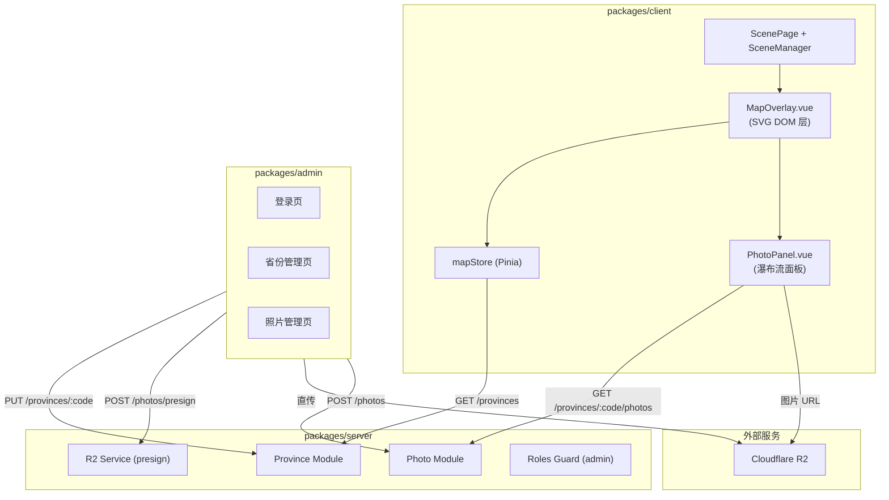

# P1 地图与照片 Design

## Context

P0 工程基座已就绪（monorepo + PixiJS 场景 + Camera + 认证）。P1 是 MVP 交付点：用户进入房间后 zoom-in 墙面看到中国地图，点击省份浏览照片。需要新增后端 Province/Photo 模块、前端地图交互组件、管理后台包。

## Goal

- 墙面 zoom-in 后渲染交互式中国地图，已去过省份高亮可点击
- 点击省份弹出照片瀑布流面板，照片从 Cloudflare R2 加载
- 管理后台支持标记省份、上传照片、编辑标注和排序

## Non-Goal

- 其他墙面功能（全家福、身高尺、日历、贴纸墙）
- 照片裁剪/滤镜/编辑
- CDN 缓存策略优化
- 移动端管理后台适配
- 照片格式自动转换

## Architecture



### Admin 角色设计

Config 表新增 `admin_password_hash`。AuthService.verify 检查顺序：owner → visitor → admin。admin 使用独立强密码，不与 owner/visitor 共用。JWT payload 中 role='admin' 时具有管理权限。

### Canvas + DOM 分层（更新）

```
z-index 层叠：
  0: <canvas> (PixiJS 场景)
  10: MapOverlay (SVG 地图，仅墙面 zoom-in 时可见)
  15: 进度文字 "已点亮 X/34"
  20: PhotoPanel (照片瀑布流面板)
  30: Vue Global UI (密码页、加载页)
```

### 数据流

```
全景 → 点击墙面热区 → Camera zoomIn('wall') → MapOverlay 可见
→ 点击省份 → PhotoPanel 打开（从省份位置展开）
→ 关闭面板 → 回到地图
→ 点击返回 → Camera zoomOut() → MapOverlay 隐藏
```

## Interface Contract

### Server API

#### GET /provinces

获取所有省份状态。公开接口（owner/visitor/admin 均可访问）。

**Response 200:**
```typescript
interface ProvinceDto {
  code: string       // "hunan"
  name: string       // "湖南"
  visited: boolean
  photoCount: number
}
// 返回 ProvinceDto[]，按 code 字母序
```

#### GET /provinces/:code/photos

获取某省份的照片列表。公开接口。

**Response 200:**
```typescript
interface PhotoDto {
  id: number
  url: string         // R2 公开 URL
  annotation: string | null
  order: number
}
// 返回 PhotoDto[]，按 order 升序
```

**Response 404:** 省份 code 不存在

#### PUT /provinces/:code (admin)

标记省份状态。需 admin 角色。

**Request:**
```typescript
interface UpdateProvinceDto {
  visited: boolean
}
```

**Response 200:** 返回更新后的 ProvinceDto

#### POST /photos/presign (admin)

获取 R2 上传签名 URL。

**Request:**
```typescript
interface PresignRequestDto {
  provinceCode: string
  filename: string    // 原始文件名，用于提取扩展名
  contentType: string // "image/webp"
}
```

**Response 200:**
```typescript
interface PresignResponseDto {
  uploadUrl: string   // presigned PUT URL，有效期 10 分钟
  key: string         // photos/{provinceCode}/{uuid}.webp
  publicUrl: string   // 文件上传后的公开访问 URL
}
```

#### POST /photos (admin)

创建照片记录（文件已上传到 R2 后调用）。

**Request:**
```typescript
interface CreatePhotoDto {
  provinceCode: string
  url: string
  annotation?: string
  order: number
}
```

**Response 201:** 返回完整 PhotoDto（含 id）

#### PUT /photos/reorder (admin)

批量更新照片排序。

**Request:**
```typescript
interface ReorderDto {
  provinceCode: string
  photoIds: number[]  // 按新顺序排列的 ID 数组
}
```

**Response 200:** 返回更新后的 PhotoDto[]

#### PUT /photos/:id (admin)

更新照片标注。

**Request:**
```typescript
interface UpdatePhotoDto {
  annotation?: string
}
```

**Response 200:** 返回更新后的 PhotoDto

#### DELETE /photos/:id (admin)

删除照片（同时删除 R2 文件）。

**Response 204**

**Response 404:** 照片 ID 不存在

**R2 删除失败时：** 数据库记录仍然删除（best-effort 清理），console.error 记录 R2 key，不阻塞响应。

### 错误响应契约

所有管理 API 共享以下错误格式：

```typescript
interface ApiErrorResponse {
  statusCode: number
  message: string
}
```

| 场景 | Status | Message |
|------|--------|---------|
| 未认证/非 admin | 403 | "权限不足" |
| 省份 code 不存在 | 404 | "省份不存在" |
| 照片 ID 不存在 | 404 | "照片不存在" |
| presign 参数非法（contentType 非 image/*）| 400 | "不支持的文件类型" |
| reorder photoIds 数量与实际不一致 | 400 | "照片ID列表与实际数量不匹配" |
| reorder 包含不存在的 photoId | 400 | "包含无效的照片ID" |
| 请求体校验失败 | 400 | 字段级错误信息 |

### Client Modules

#### MapOverlay.vue

```typescript
// Props
interface MapOverlayProps {
  visible: boolean           // 是否显示（由 Camera state 控制）
  cameraTransform: {         // 同步 Camera 的 CSS transform 参数
    scale: number
    x: number
    y: number
  }
}

// Emits
interface MapOverlayEmits {
  'province-click': [code: string]  // 点击已去过的省份
}
```

#### PhotoPanel.vue

```typescript
// Props
interface PhotoPanelProps {
  provinceCode: string | null  // null 时面板关闭
  originRect: DOMRect | null   // 省份元素位置，用于展开动画起点
}

// Emits
interface PhotoPanelEmits {
  'close': []
}
```

#### mapStore (Pinia)

```typescript
interface MapState {
  provinces: ProvinceDto[]
  loading: boolean
}

interface MapActions {
  fetchProvinces(): Promise<void>
}
```

## Data Model

### Prisma Schema 新增

```prisma
model Province {
  code       String  @id          // "hunan", "guangdong"...
  name       String               // "湖南", "广东"...
  visited    Boolean @default(false)
  photos     Photo[]
}

model Photo {
  id           Int      @id @default(autoincrement())
  provinceCode String
  province     Province @relation(fields: [provinceCode], references: [code])
  url          String                // R2 公开 URL
  annotation   String?
  order        Int      @default(0)
  createdAt    DateTime @default(now())
}
```

### Seed Data

34 个省级行政区硬编码到 seed.ts，其中湖南、广西、河北、广东 visited=true。

## Non-Functional Requirements

| 维度 | 指标 |
|------|------|
| 性能 | 照片面板首屏 ≤ 1s；地图 SVG ≤ 100KB gzipped |
| 安全 | 管理 API 需 admin 角色鉴权；presigned URL 有效期 10 分钟 |
| 兼容性 | 前台 Chrome 90+/Safari 15+/Firefox 90+；后台 Chrome 90+ |
| 可观测性 | R2 上传失败时 console.error + toast 提示 |

## Alternatives Considered

| 方案 | 优点 | 缺点 | 不选原因 |
|------|------|------|---------|
| SVG 渲染在 PixiJS 内部 | 天然跟随 Camera | hover/click 需自建 hitTest，文字缩放模糊 | DOM 层 hover/click 更自然 |
| 照片经 server 代理上传 | 实现简单 | 大文件阻塞 server，内存压力 | presigned URL 让 server 无压力 |
| 管理后台独立认证 | 前后台隔离 | 过度设计，只一个人用 | 复用现有 auth + admin role 最简 |
| 照片面板底部滑入 | 实现简单 | 空间连续感弱 | 从省份位置展开体验更好 |

## Testing Strategy

| 测试对象 | 层级 | 关键用例 |
|---------|------|---------|
| Province API (CRUD) | 集成 | GET 返回 34 省；PUT 修改 visited；403 鉴权拦截 |
| Photo API (CRUD + presign) | 集成 | presign 返回有效 URL；创建/删除照片；reorder 更新顺序 |
| Roles Guard | 单元 | admin 放行；owner/visitor 拒绝 |
| MapOverlay (SVG 渲染) | 集成 | 已去过省份有高亮 class；点击触发 emit |
| PhotoPanel (瀑布流) | 集成 | 照片按 order 排列；空状态显示提示 |
| mapStore | 单元 | fetchProvinces 填充 state |

## Milestones

| 阶段 | 产出 | 依赖 |
|------|------|------|
| M1: 后端 Province/Photo API | API 可用 + 测试通过 | P0 server 基座 |
| M2: 地图 SVG + 前端交互 | 墙面 zoom-in → 地图渲染 → 点击省份 | M1 |
| M3: 照片面板 | 瀑布流 + 懒加载 + 标注 | M1 |
| M4: 管理后台 | admin 包 + 省份/照片管理 | M1 |
