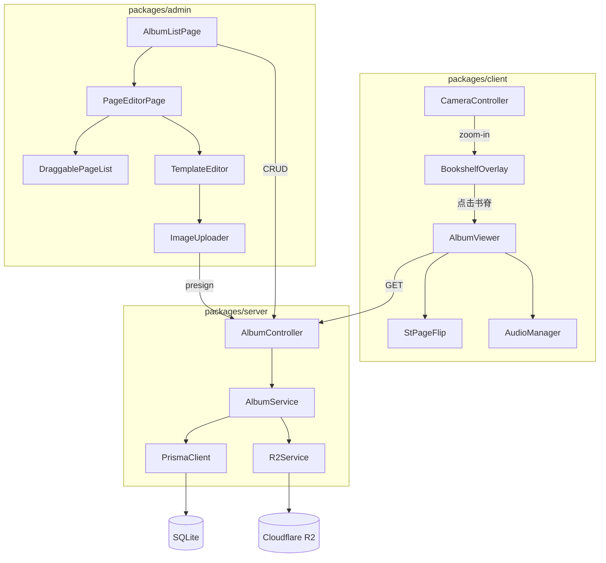

# P2 相册

## Context

当前项目是一个情侣私密空间应用，已具备省份地图、照片墙、认证鉴权、R2 对象存储等基础能力。用户希望以「年度相册」形式回顾每年的照片记忆，需要一个书架 → 翻页浏览的沉浸式相册模块。

项目为 monorepo 结构（packages/client、server、admin、shared），server 端基于 NestJS + Prisma + SQLite，client 端使用 Vue 3 + PixiJS + GSAP + Howler.js，admin 端使用 Vue 3 + Element Plus。已有 Camera 系统管理 zoom-in/out，DOM overlay 模式已在 MapOverlay 中验证可行。

## Goal

1. 提供按年度组织的相册浏览体验：书架展示 → 点击书脊 → 翻页阅读
2. 管理后台支持相册 CRUD、页面拖拽排序、模板化内容编辑、图片压缩上传
3. 翻页交互支持桌面端双页和移动端单页，附带翻页音效
4. 复用已有 R2 presign 上传链路和 Camera/DOM overlay 架构

## Non-Goal

1. 不支持用户自定义模板或自由拖拽排版，仅提供 5 种预设模板
2. 不支持相册评论、点赞等社交互动功能
3. 不支持视频内容嵌入，仅处理静态图片和文字
4. 不做相册分享/导出 PDF 功能

## Error Handling

| 失败场景 | 处理策略 |
|----------|----------|
| R2 presign 请求失败 | 返回 502，前端提示"上传服务暂时不可用，请稍后重试" |
| R2 delete 失败（删除相册时） | 数据库事务仍提交（优先保证数据一致性），记录失败的 key 到日志，不阻塞用户操作 |
| StPageFlip 初始化失败 | 前端降级为简单图片列表滚动浏览 |
| 图片加载超时（5s） | 显示占位图 + "加载失败，点击重试" |
| Canvas 压缩失败（浏览器不支持 WebP） | fallback 为 JPEG quality 0.85 |

## Architecture



### 前端 Client 架构

- **BookshelfOverlay**：DOM overlay 层，Camera zoom-in 到书架区域后显示
- **书脊渲染**：CSS flexbox 横排竖条，`writing-mode: vertical-rl` 显示年份，颜色通过 `year % palette.length` 从预设色板取色
- **AlbumViewer**：封装 StPageFlip，管理翻页逻辑、懒加载、音效播放
- **响应式**：视口宽 ≥768px 双页模式，<768px 单页模式，resize 时销毁重建实例

### 管理后台 Admin 架构

- **AlbumListPage**：El-Table 展示相册列表，支持新增/编辑/删除
- **PageEditorPage**：左侧 vuedraggable 拖拽排序页面列表，右侧模板选择 + 内容编辑面板
- **ImageUploader**：前端 canvas 压缩（1200px 宽，WebP quality 0.85）后通过 presign 上传至 R2
- **AlbumPreview**：Admin 内独立实现的翻页预览组件（直接引入 st-page-flip + 复用相同模板渲染逻辑），与 Client 的 AlbumViewer 实现相同逻辑但独立维护，避免跨 package 依赖

## Interface Contract

### GET /albums

获取所有相册列表（公开）。

- **Auth**: 无
- **Response 200**:
```json
{
  "data": [
    {
      "id": "string",
      "year": 2024,
      "title": "2024年的回忆",
      "coverUrl": "string | null",
      "createdAt": "ISO8601"
    }
  ]
}
```

### GET /albums/:id/pages

获取指定相册的所有页面（公开）。

- **Auth**: 无
- **Params**: `id` — 相册 ID
- **Response 200**:
```json
{
  "data": [
    {
      "id": "string",
      "albumId": "string",
      "order": 1,
      "templateId": "single",
      "content": {
        "images": ["url1"],
        "text": "optional text"
      },
      "createdAt": "ISO8601"
    }
  ]
}
```
- **Error 404**: `{ "message": "Album not found" }`

### POST /albums

创建相册（管理员）。

- **Auth**: RolesGuard (admin)
- **Body**:
```json
{
  "year": 2024,
  "title": "string (可选)",
  "coverUrl": "string (可选)"
}
```
- **Response 201**: 创建的 Album 对象
- **Error 400**: `{ "message": "Validation failed" }`
- **Error 409**: `{ "message": "Album for year {year} already exists" }`

### PUT /albums/:id

更新相册（管理员）。Body 为 Partial，只需传变更字段。

- **Auth**: RolesGuard (admin)
- **Params**: `id` — 相册 ID
- **Body** (Partial):
```json
{
  "year": 2024,
  "title": "string",
  "coverUrl": "string"
}
```
- **Response 200**: 更新后的 Album 对象
- **Error 404**: `{ "message": "Album not found" }`
- **Error 409**: `{ "message": "Album for year {year} already exists" }`

### DELETE /albums/:id

删除相册（管理员），级联删除所有 pages 并同步删除 R2 中关联图片。

- **Auth**: RolesGuard (admin)
- **Params**: `id` — 相册 ID
- **Response 204**: 无内容
- **Error 404**: `{ "message": "Album not found" }`

### POST /albums/:id/pages

为相册添加页面（管理员）。

- **Auth**: RolesGuard (admin)
- **Params**: `id` — 相册 ID
- **Body**:
```json
{
  "templateId": "single | double-h | double-v | triple | photo-text",
  "content": {
    "images": ["url1"],
    "text": "optional"
  },
  "order": 1
}
```
- **Response 201**: 创建的 Page 对象
- **Error 404**: `{ "message": "Album not found" }`
- **Error 400**: `{ "message": "Validation failed" }`

### PUT /pages/:id

更新页面内容（管理员）。

- **Auth**: RolesGuard (admin)
- **Params**: `id` — 页面 ID
- **Body**:
```json
{
  "templateId": "single | double-h | double-v | triple | photo-text",
  "content": {
    "images": ["url1"],
    "text": "optional"
  }
}
```
- **Response 200**: 更新后的 Page 对象
- **Error 404**: `{ "message": "Page not found" }`

### PUT /albums/:id/pages/reorder

批量更新页面顺序（管理员）。pageIds 数组的顺序即为新的 order（index+1）。

- **Auth**: RolesGuard (admin)
- **Params**: `id` — 相册 ID
- **Body**:
```json
{
  "pageIds": ["pageId1", "pageId2", "pageId3"]
}
```
- **Response 200**: `{ "message": "ok" }`
- **Error 400**: `{ "message": "pageIds count does not match actual page count" }`
- **Error 404**: `{ "message": "Album not found" }`

### DELETE /pages/:id

删除页面（管理员）。

- **Auth**: RolesGuard (admin)
- **Params**: `id` — 页面 ID
- **Response 204**: 无内容
- **Error 404**: `{ "message": "Page not found" }`

### POST /photos/presign（复用已有）

获取 R2 presigned URL 用于图片上传。

## Data Model

```prisma
model Album {
  id        String   @id @default(cuid())
  year      Int      @unique
  title     String?
  coverUrl  String?
  createdAt DateTime @default(now())
  pages     Page[]
}

model Page {
  id         String   @id @default(cuid())
  albumId    String
  album      Album    @relation(fields: [albumId], references: [id], onDelete: Cascade)
  order      Int
  templateId String
  content    String   // JSON: { images: string[], text?: string }
  createdAt  DateTime @default(now())

  @@index([albumId, order])
}
```

**templateId 枚举值**:
| 模板 ID | 图片数 | 描述 |
|---------|--------|------|
| single | 1 | 单图全页 |
| double-h | 2 | 双图左右排列 |
| double-v | 2 | 双图上下排列 |
| triple | 3 | 三图组合 |
| photo-text | 1 | 单图 + 文字描述 |

## Non-Functional Requirements

| 指标 | 目标值 | 度量方式 |
|------|--------|----------|
| 翻页动画帧率 | ≥ 30fps | Chrome DevTools Performance 面板 |
| 书架首屏渲染 | ≤ 1s | Lighthouse FCP |
| 图片懒加载范围 | 当前页 ± 2 页 | 代码实现 |
| 上传图片压缩 | 1200px 宽，WebP quality 0.85 | canvas 输出验证 |
| 浏览器兼容性 | Chrome 90+, Safari 15+, Firefox 90+ | 手动测试 |
| 页面比例 | 3:4 自适应视口 | CSS 约束 |
| 响应式断点 | 768px（双页/单页切换） | resize 事件 |

## Alternatives Considered

| 方案 | 备选 | 最终选择 | 理由 |
|------|------|----------|------|
| 书架渲染方式 | PixiJS 精灵渲染 | DOM overlay | 与已有 MapOverlay 架构一致，无需书脊贴图资源 |
| 翻页库 | turn.js / 自实现 | StPageFlip (st-page-flip) | 无外部依赖、轻量、支持触摸事件 |
| 页面排版 | 自由拖拽排版 | 预设模板 | 工作量可控，视觉统一，降低用户操作复杂度 |

## Testing Strategy

| 测试对象 | 层级 | 验证方法 | 通过标准 |
|----------|------|----------|----------|
| AlbumService CRUD | 单元测试 | Jest mock Prisma | 所有 CRUD 操作返回正确数据，级联删除触发 R2 清理 |
| AlbumController 路由守卫 | 集成测试 | supertest + JWT | 公开接口无需 token，admin 接口需合法 token |
| 删除相册 R2 清理 | 单元测试 | Jest mock R2Service | 遍历 pages content 提取所有图片 key 并调用批量删除 |
| reorder 接口 | 集成测试 | supertest | 批量更新后 GET pages 返回正确顺序 |
| BookshelfOverlay 渲染 | 组件测试 | Vitest + @vue/test-utils | 书脊数量与 albums 数据一致，颜色取模正确 |
| AlbumViewer 翻页 | E2E 测试 | Playwright | 点击翻页后页码变化，双页/单页模式切换正确 |
| 图片压缩上传 | 组件测试 | Vitest mock canvas | 输出宽度 ≤1200px，格式为 WebP |
| Admin 页面编辑拖拽排序 | E2E 测试 | Playwright | 拖拽后顺序持久化，刷新后保持 |

## Milestones

| 阶段 | 交付内容 | 预估工时 |
|------|----------|----------|
| M1: 数据层 | Prisma schema、AlbumService、AlbumController、路由守卫、单元/集成测试 | 1d |
| M2: 管理后台 | 相册列表页 CRUD、页面编辑页（拖拽排序 + 模板编辑 + 图片压缩上传） | 1.5d |
| M3: Client 书架 | BookshelfOverlay、书脊渲染、hover 动画、Camera zoom-in 集成 | 1d |
| M4: Client 翻页 | AlbumViewer + StPageFlip 集成、响应式、懒加载、翻页音效、封面/封底 | 1.5d |
| M5: 联调收尾 | Admin 预览、删除 R2 清理验证、E2E 测试、性能验收 | 1d |
