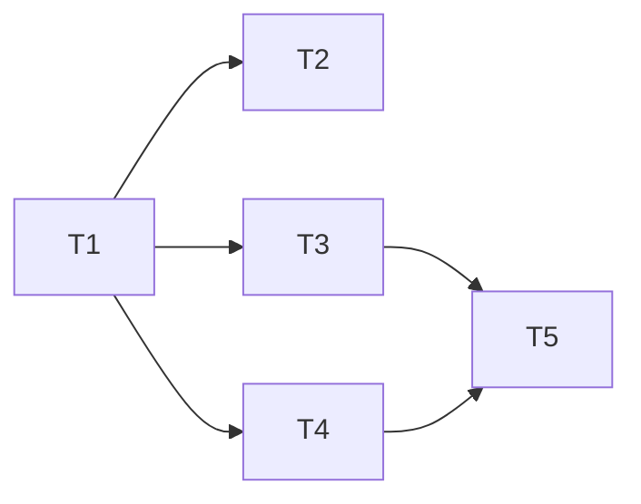

# P2 相册

**Branch:** feat/p2-album
**Baseline SHA:** b168d0d
**Worktree Path:** /home/yangyang/workspace/codes/YoungerYang/secret-space
**Started At:** 2026-06-25T08:12:00+08:00
**Updated At:** 2026-06-25T08:12:00+08:00

**Goal:** 实现年度相册系统：书架浏览 → 翻页阅读 → 管理后台内容编辑
**Architecture:** Server 新增 Album/Page 模块（Prisma + NestJS），Client 用 DOM overlay 渲染书架 + StPageFlip 翻页视图，Admin 扩展相册管理页面（模板编辑+拖拽排序+图片压缩上传）
**Tech Stack:** NestJS, Prisma (SQLite), Vue 3, GSAP, StPageFlip (page-flip), Pinia, Element Plus, vuedraggable, canvas API

## Dependency Graph



| Task | 依赖 | 可并行组 |
|------|------|---------|
| T1: Album/Page Schema + CRUD API | 无 | A |
| T2: 管理后台相册管理 | T1 | B |
| T3: Client 书架交互 | T1 | B |
| T4: Client 翻页视图 | T1 | B |
| T5: 联调与收尾 | T3, T4 | C |

---

### Task 1: Album/Page Schema + CRUD API

**Depends on:** 无

**Files:**
- Modify: `packages/server/prisma/schema.prisma`
- Create: `packages/server/src/album/album.module.ts`
- Create: `packages/server/src/album/album.controller.ts`
- Create: `packages/server/src/album/album.service.ts`
- Create: `packages/server/src/album/dto/album.dto.ts`
- Create: `packages/server/src/album/dto/page.dto.ts`
- Modify: `packages/server/src/app.module.ts`
- Test: `packages/server/src/album/__tests__/album.controller.test.ts`

**Behavior:**
新增 Album 和 Page 模型，提供完整 CRUD API。公开接口无需认证，写接口需 admin 角色。删除相册时级联删除 pages 并同步清理 R2 文件。

**Execution:**
- **Status:** pending
- **Commit SHA:** null
- **Attempts:** 0
- **Blocked Reason:** null

- [ ] **Step 1: Confirm baseline**

```typescript
// packages/server/src/album/__tests__/album.controller.test.ts
describe('Album API', () => {
  // --- Albums CRUD ---
  it('GET /albums returns empty array initially', async () => {
    const res = await request(app.getHttpServer()).get('/albums')
    expect(res.status).toBe(200)
    expect(res.body).toEqual([])
  })

  it('POST /albums creates album with admin token', async () => {
    const res = await request(app.getHttpServer())
      .post('/albums')
      .set('Authorization', `Bearer ${adminToken}`)
      .send({ year: 2024, title: '2024年的回忆', coverUrl: 'https://example.com/cover.jpg' })
    expect(res.status).toBe(201)
    expect(res.body.year).toBe(2024)
  })

  it('POST /albums returns 409 for duplicate year', async () => {
    // 已存在 2024
    const res = await request(app.getHttpServer())
      .post('/albums').set('Authorization', `Bearer ${adminToken}`)
      .send({ year: 2024 })
    expect(res.status).toBe(409)
  })

  it('POST /albums returns 401 without token', async () => {
    const res = await request(app.getHttpServer()).post('/albums').send({ year: 2025 })
    expect(res.status).toBe(401)
  })

  it('PUT /albums/:id updates title', async () => {
    const res = await request(app.getHttpServer())
      .put(`/albums/${albumId}`).set('Authorization', `Bearer ${adminToken}`)
      .send({ title: '新标题' })
    expect(res.status).toBe(200)
    expect(res.body.title).toBe('新标题')
  })

  it('PUT /albums/:id returns 409 for year conflict', async () => {
    // 已存在 2024 和 2025, 尝试把 2025 改为 2024
    const res = await request(app.getHttpServer())
      .put(`/albums/${album2025Id}`).set('Authorization', `Bearer ${adminToken}`)
      .send({ year: 2024 })
    expect(res.status).toBe(409)
  })

  it('DELETE /albums/:id cascades pages and R2 files', async () => {
    // 创建 album + page(含图片) → 删除 → 验证 page 不存在 + R2 delete 被调用
  })

  it('DELETE /albums/nonexistent returns 404', async () => {
    const res = await request(app.getHttpServer())
      .delete('/albums/nonexistent').set('Authorization', `Bearer ${adminToken}`)
    expect(res.status).toBe(404)
  })

  // --- Pages CRUD ---
  it('GET /albums/:id/pages returns pages sorted by order', async () => {
    const res = await request(app.getHttpServer()).get(`/albums/${albumId}/pages`)
    expect(res.status).toBe(200)
    expect(Array.isArray(res.body)).toBe(true)
  })

  it('POST /albums/:id/pages creates page', async () => {
    const res = await request(app.getHttpServer())
      .post(`/albums/${albumId}/pages`).set('Authorization', `Bearer ${adminToken}`)
      .send({ templateId: 'single', content: { images: ['url.jpg'] }, order: 1 })
    expect(res.status).toBe(201)
    expect(res.body.templateId).toBe('single')
  })

  it('POST /albums/:id/pages returns 400 for invalid templateId', async () => {
    const res = await request(app.getHttpServer())
      .post(`/albums/${albumId}/pages`).set('Authorization', `Bearer ${adminToken}`)
      .send({ templateId: 'invalid', content: { images: [] }, order: 1 })
    expect(res.status).toBe(400)
  })

  it('POST /albums/nonexistent/pages returns 404', async () => {
    const res = await request(app.getHttpServer())
      .post('/albums/nonexistent/pages').set('Authorization', `Bearer ${adminToken}`)
      .send({ templateId: 'single', content: { images: ['x.jpg'] }, order: 1 })
    expect(res.status).toBe(404)
  })

  it('PUT /pages/:id updates content', async () => {
    const res = await request(app.getHttpServer())
      .put(`/pages/${pageId}`).set('Authorization', `Bearer ${adminToken}`)
      .send({ templateId: 'double-h', content: { images: ['a.jpg', 'b.jpg'] } })
    expect(res.status).toBe(200)
    expect(res.body.templateId).toBe('double-h')
  })

  it('DELETE /pages/:id returns 204', async () => {
    const res = await request(app.getHttpServer())
      .delete(`/pages/${pageId}`).set('Authorization', `Bearer ${adminToken}`)
    expect(res.status).toBe(204)
  })

  it('PUT /albums/:id/pages/reorder updates order', async () => {
    // 创建 3 pages → reorder [p3,p1,p2] → GET pages 验证新顺序
  })

  it('PUT /albums/:id/pages/reorder returns 400 for incomplete pageIds', async () => {
    // 3 pages 但只传 2 个 id
    const res = await request(app.getHttpServer())
      .put(`/albums/${albumId}/pages/reorder`).set('Authorization', `Bearer ${adminToken}`)
      .send({ pageIds: ['p1', 'p2'] })
    expect(res.status).toBe(400)
  })
})
```

Run: `pnpm --filter @secret-space/server test -- --testPathPattern album`
Expected: **FAIL** — 模块不存在

- [ ] **Step 2: Implement**

```
// schema.prisma: 新增 Album + Page 模型（见 design Data Model）
// album.service.ts:
//   findAll(): 返回所有 albums 按 year 升序
//   findPages(albumId): 返回 pages 按 order 升序，404 if album not found
//   create(dto): 创建，409 if year exists
//   update(id, dto): 更新，404/409 处理
//   delete(id):
//     1. 查找 album + pages
//     2. 从 pages content 提取所有 image URLs → 解析 key
//     3. r2Service.delete(keys) — 失败仅记录日志不阻塞
//     4. prisma.album.delete (onDelete: Cascade 处理 pages)
//   createPage(albumId, dto): 校验 templateId ∈ VALID_TEMPLATES
//   updatePage(pageId, dto): 校验 templateId
//   reorderPages(albumId, pageIds): 校验数量匹配 → 批量 update order
//   deletePage(pageId): 提取 content images keys → r2 delete → prisma delete
//
// album.controller.ts:
//   GET /albums (公开), GET /albums/:id/pages (公开)
//   POST/PUT/DELETE (admin, @UseGuards(RolesGuard) + @Roles('admin'))
```

- [ ] **Step 3: Verify**

Run: `cd packages/server && npx prisma migrate dev --name add-album-page && pnpm test -- --testPathPattern album`
Expected: **PASS**

- [ ] **Step 4: Commit**

`feat(server): 新增 Album/Page 模型与 CRUD API`

---

### Task 2: 管理后台相册管理

**Depends on:** T1

**Files:**
- Create: `packages/admin/src/views/AlbumList.vue`
- Create: `packages/admin/src/views/PageEditor.vue`
- Create: `packages/admin/src/components/TemplateSelector.vue`
- Create: `packages/admin/src/components/ImageUploader.vue`
- Create: `packages/admin/src/utils/compress.ts`
- Modify: `packages/admin/src/router/index.ts`
- Modify: `packages/admin/package.json` (add vuedraggable)
- Test: `packages/admin/src/utils/__tests__/compress.test.ts`

**Behavior:**
管理后台新增相册管理页（CRUD 表格）和页面编辑页（左侧拖拽排序 + 右侧模板选择内容编辑）。图片上传前端 canvas 压缩到 1200px 宽 WebP。

**Execution:**
- **Status:** pending
- **Commit SHA:** null
- **Attempts:** 0
- **Blocked Reason:** null

- [ ] **Step 1: Confirm baseline**

```typescript
// packages/admin/src/utils/__tests__/compress.test.ts
import { describe, it, expect } from 'vitest'
import { compressImage } from '../compress'

describe('compressImage', () => {
  it('outputs width <= 1200 for large image', async () => {
    // 创建 3000x4000 canvas → toBlob → compressImage → 验证输出宽度
  })

  it('preserves aspect ratio', async () => {
    // 输入 3000x2000 → 输出 1200x800
  })

  it('outputs WebP format', async () => {
    // 验证输出 blob.type === 'image/webp'
  })
})
```

Run: `pnpm --filter @secret-space/admin test -- --testPathPattern compress`
Expected: **FAIL** — 模块不存在

- [ ] **Step 2: Implement**

```typescript
// compress.ts:
//   compressImage(file: File, maxWidth = 1200, quality = 0.85): Promise<Blob>
//     1. createImageBitmap(file)
//     2. 计算目标尺寸（保持比例，宽度 <= maxWidth）
//     3. canvas.drawImage → canvas.toBlob('image/webp', quality)
//     4. 浏览器不支持 webp → fallback canvas.toBlob('image/jpeg', quality)

// AlbumList.vue:
//   El-Table 显示 year/title/coverUrl/pageCount + 新建/编辑/删除按钮
//   新建/编辑弹窗: El-Form (year + title + 封面上传)

// PageEditor.vue:
//   左侧: vuedraggable 列表渲染缩略卡片，@end 触发 reorder API
//   右侧: TemplateSelector + 对应槽位的 ImageUploader + 文字 El-Input
//   新增页面按钮，删除页面按钮

// TemplateSelector.vue:
//   5 种模板缩略图 radio 选择

// ImageUploader.vue:
//   El-Upload 自定义上传: file → compressImage → presign → PUT R2 → 返回 URL
```

- [ ] **Step 3: Verify**

Run: `pnpm --filter @secret-space/admin test && pnpm --filter @secret-space/admin build`
Expected: **PASS**，构建无错误

- [ ] **Step 4: Commit**

`feat(admin): 相册管理页与页面编辑器`

---

### Task 3: Client 书架交互

**Depends on:** T1

**Files:**
- Create: `packages/client/src/components/BookshelfOverlay.vue`
- Create: `packages/client/src/stores/album.ts`
- Modify: `packages/client/src/views/ScenePage.vue`
- Modify: `packages/client/src/pixi/zones.ts` (确认书架热区定义)
- Test: `packages/client/src/stores/__tests__/album.test.ts`

**Behavior:**
Camera zoom-in 到书架区域后显示 DOM overlay，渲染书脊列表（CSS 竖条+年份文字+颜色），hover 抽出动画（GSAP），点击书脊触发打开相册事件。

**Execution:**
- **Status:** pending
- **Commit SHA:** null
- **Attempts:** 0
- **Blocked Reason:** null

- [ ] **Step 1: Confirm baseline**

```typescript
// packages/client/src/stores/__tests__/album.test.ts
import { describe, it, expect, beforeEach } from 'vitest'
import { setActivePinia, createPinia } from 'pinia'
import { useAlbumStore } from '../album'

describe('albumStore', () => {
  beforeEach(() => setActivePinia(createPinia()))

  it('fetchAlbums populates state', async () => {
    const store = useAlbumStore()
    await store.fetchAlbums()
    expect(store.albums).toBeInstanceOf(Array)
  })

  it('getSpineColor returns consistent color for same year', () => {
    const store = useAlbumStore()
    const c1 = store.getSpineColor(2024)
    const c2 = store.getSpineColor(2024)
    expect(c1).toBe(c2)
  })

  it('getSpineColor returns different colors for adjacent years', () => {
    const store = useAlbumStore()
    const c1 = store.getSpineColor(2024)
    const c2 = store.getSpineColor(2025)
    expect(c1).not.toBe(c2)
  })
})
```

Run: `pnpm --filter @secret-space/client test -- --testPathPattern album`
Expected: **FAIL** — store 不存在

- [ ] **Step 2: Implement**

```typescript
// stores/album.ts:
//   state: { albums: Album[], currentAlbumId: string | null }
//   actions: fetchAlbums(), fetchPages(albumId)
//   getters: getSpineColor(year) → PALETTE[year % PALETTE.length]
//   PALETTE: 8 色数组 (暖色系柔和色)

// BookshelfOverlay.vue:
//   props: visible
//   emit: open-album(albumId)
//   template: flex 容器 → v-for album → 竖条 div (书脊)
//   书脊样式: width 45px, height 100%, writing-mode vertical-rl, background-color 取 getSpineColor
//   @mouseenter: gsap.to(el, { y: -15, boxShadow: '...', duration: 0.3, ease: 'power2.out' })
//   @mouseleave: gsap.to(el, { y: 0, boxShadow: 'none', duration: 0.3 })
//   @click: emit('open-album', album.id)
//   空状态: v-if albums.length === 0 → "还没有相册哦～"

// ScenePage.vue: 集成 BookshelfOverlay（camera zone=shelf 时显示）
```

- [ ] **Step 3: Verify**

Run: `pnpm --filter @secret-space/client test -- --testPathPattern album`
Expected: **PASS**

- [ ] **Step 4: Commit**

`feat(client): 书架 DOM overlay + 书脊交互动画`

---

### Task 4: Client 翻页视图

**Depends on:** T1

**Files:**
- Create: `packages/client/src/components/AlbumViewer.vue`
- Create: `packages/client/src/components/templates/SingleTemplate.vue`
- Create: `packages/client/src/components/templates/DoubleHTemplate.vue`
- Create: `packages/client/src/components/templates/DoubleVTemplate.vue`
- Create: `packages/client/src/components/templates/TripleTemplate.vue`
- Create: `packages/client/src/components/templates/PhotoTextTemplate.vue`
- Create: `packages/client/src/components/templates/CoverPage.vue`
- Create: `packages/client/src/components/templates/BackCoverPage.vue`
- Modify: `packages/client/package.json` (add page-flip)
- Modify: `packages/client/src/views/ScenePage.vue`
- Test: `packages/client/src/components/__tests__/AlbumViewer.test.ts`

**Behavior:**
全屏翻页视图，封装 StPageFlip，支持双页/单页模式（768px 断点），图片懒加载（±2页），翻页音效，ESC/按钮关闭。每页根据 templateId 渲染对应布局模板。

**Execution:**
- **Status:** pending
- **Commit SHA:** null
- **Attempts:** 0
- **Blocked Reason:** null

- [ ] **Step 1: Confirm baseline**

```typescript
// packages/client/src/components/__tests__/AlbumViewer.test.ts
import { describe, it, expect, vi } from 'vitest'
import { mount } from '@vue/test-utils'
import AlbumViewer from '../AlbumViewer.vue'

describe('AlbumViewer', () => {
  it('renders cover page with album title', () => {
    const wrapper = mount(AlbumViewer, {
      props: {
        album: { id: '1', year: 2024, title: '2024年的回忆', coverUrl: '/cover.jpg' },
        pages: []
      }
    })
    expect(wrapper.text()).toContain('2024年的回忆')
  })

  it('renders correct template for each page', () => {
    const wrapper = mount(AlbumViewer, {
      props: {
        album: { id: '1', year: 2024, title: 'test', coverUrl: null },
        pages: [{ id: 'p1', templateId: 'single', content: { images: ['/img.jpg'] }, order: 1 }]
      }
    })
    expect(wrapper.find('.template-single').exists()).toBe(true)
  })

  it('emits close on ESC key', async () => {
    const wrapper = mount(AlbumViewer, {
      props: { album: { id: '1', year: 2024, title: '', coverUrl: null }, pages: [] }
    })
    await wrapper.trigger('keydown', { key: 'Escape' })
    expect(wrapper.emitted('close')).toBeTruthy()
  })
})
```

Run: `pnpm --filter @secret-space/client test -- --testPathPattern AlbumViewer`
Expected: **FAIL** — 组件不存在

- [ ] **Step 2: Implement**

```typescript
// AlbumViewer.vue:
//   props: album, pages
//   emit: close
//   onMounted:
//     1. 判断视口宽度 → 双页(>=768)/单页(<768)
//     2. new PageFlip(el, { width, height, size: 'stretch', showCover: true })
//     3. 渲染 pages: [CoverPage, ...contentPages, BackCoverPage]
//     4. window.addEventListener('resize', handleResize)
//     5. document.addEventListener('keydown', onEsc)
//   handleResize: debounce → 宽度跨 768px 时 destroy + 重建实例
//   翻页回调: audioManager.playSfx('page-flip')
//   懒加载: 监听翻页事件 → 预加载 currentPage ± 2 范围内的图片
//   onUnmounted: destroy PageFlip, removeEventListener

// 模板组件 (SingleTemplate 等):
//   props: content: { images: string[], text?: string }
//   根据模板类型渲染对应 CSS grid 布局
//   img 标签使用 loading="lazy" + IntersectionObserver

// ScenePage.vue: 集成 AlbumViewer（book-shelf emit open-album → fetchPages → 显示 AlbumViewer）
```

- [ ] **Step 3: Verify**

Run: `pnpm --filter @secret-space/client test -- --testPathPattern AlbumViewer`
Expected: **PASS**

- [ ] **Step 4: Commit**

`feat(client): AlbumViewer 翻页视图 + 模板渲染 + 懒加载`

---

### Task 5: 联调与收尾

**Depends on:** T3, T4

**Files:**
- Modify: `packages/client/src/views/ScenePage.vue` (完整流程串联)
- Modify: `packages/client/src/components/BookshelfOverlay.vue` (与 AlbumViewer 联动)
- Modify: `packages/admin/src/views/PageEditor.vue` (预览功能)

**Behavior:**
完整流程串联：书架 zoom-in → 书脊点击 → 加载 pages → 翻页视图打开 → 关闭回到书架。Admin 预览按钮弹出翻页视图。验证删除相册 R2 清理、翻页性能。

**Execution:**
- **Status:** pending
- **Commit SHA:** null
- **Attempts:** 0
- **Blocked Reason:** null

- [ ] **Step 1: Confirm baseline**

```bash
# 验证前序 Task 已完成
pnpm --filter @secret-space/server test
pnpm --filter @secret-space/client test
pnpm --filter @secret-space/admin build
```
Expected: 全部 PASS

- [ ] **Step 2: Implement**

```
// ScenePage.vue:
//   BookshelfOverlay @open-album → albumStore.fetchPages(id) → showAlbumViewer = true
//   AlbumViewer @close → showAlbumViewer = false, BookshelfOverlay 恢复可见

// PageEditor.vue 预览:
//   "预览" 按钮 → 弹出 dialog 内嵌简化版 AlbumViewer（Admin 内独立实现，引入 page-flip）
```

- [ ] **Step 3: Verify**

Run: `pnpm -r build && pnpm --filter @secret-space/server test && pnpm --filter @secret-space/client test`
Expected: **PASS**，全量构建无错误

- [ ] **Step 4: Commit**

`feat: P2 相册联调收尾（完整流程串联 + Admin 预览）`
