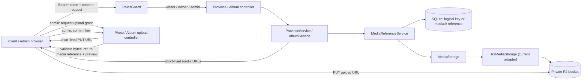

# 私有媒体读取设计

**逻辑版本：** 0.1.0
**追踪项：** DR-001
**规模：** 大（覆盖存储模块、R2 adapter、照片、相册、授权读取与两个 Vue 应用）
**Resolved Path:** `docs/active/0.1.0/remediation/dr-001-private-media/`

## Context

服务端的省份和相册读取接口已有角色控制，但上传流程会生成以 `R2_PUBLIC_URL` 拼接的永久直连地址。只要 R2 桶或自定义域名允许公开读取，取得该地址的匿名者就能绕过 API 授权读取私密媒体。

本设计使用供应商无关的 `MediaStorage` 模块，并以 R2 作为当前 adapter：持久层只保存可验证的逻辑媒体引用，服务端在现有角色校验通过后为本次读取响应签发短期 GET 地址。现有 API 路径保持不变，客户端继续把返回的 `url`、`coverUrl` 和页面图片字符串用作 `` 来源，但这些值改为短期地址。

## Goal

在本项交付后，匿名请求受保护内容始终得到 401；所有授权内容响应中的照片、封面和页面图片地址有效期不超过 300 秒；新增保存不再持久化公开媒体 URL。

## Non-Goal

- 不把管理员 JWT 从 `localStorage` 迁移到 httpOnly Cookie；该风险由 DR-003 处理。
- 不实现对象删除重试、失败队列或 `Photo`/`Album` 的最终存储字段迁移；该闭环由 DR-002 处理。
- 不修改相册模板数量、排序和内容业务规则；这些由 DR-005 处理。
- 不支持任意第三方图片域名作为私密媒体来源。

## Architecture



数据流分为两条：

1. 读取：`RolesGuard` 先拒绝匿名或无权角色；业务服务从存储记录取规范引用，`MediaReferenceService` 验证逻辑 key 后交给 `MediaStorage` 签发 GET URL，再返回给浏览器。
2. 写入：管理员先取得 PUT 签名，上传后必须确认对象。`MediaStorage` 读取对象首段并校验大小、文件头和 key 前缀；只有确认成功才返回 `media://<logical-key>` 与短期预览地址。创建/更新接口只接受该规范引用，不接受签名 URL。

## Interface Contract

### MediaStorage

```ts
type UploadGrant = {
  uploadUrl: string
  key: string
  uploadExpiresIn: 600
}

type ConfirmedUpload = {
  mediaRef: `media://${string}`
  readUrl: string
  readExpiresIn: 300
}

presignPhotoUpload(provinceCode: string, ext: '.jpg' | '.jpeg' | '.png' | '.webp', contentType: 'image/jpeg' | 'image/png' | 'image/webp'): Promise<UploadGrant>
presignAlbumUpload(ext: '.jpg' | '.jpeg' | '.png' | '.webp', contentType: 'image/jpeg' | 'image/png' | 'image/webp'): Promise<UploadGrant>
confirmUpload(key: string): Promise<ConfirmedUpload>
presignRead(key: string): Promise<string>
delete(key: string): Promise<void>
```

- 这是一个深模块：它集中签名、读取首段、对象元数据、删除和存储错误映射；业务模块和客户端只知道逻辑 key 与短期读取 URL。
- 当前 `R2MediaStorage` adapter 使用 `PutObjectCommand` 签发上传、使用 `GetObjectCommand` 签发读取；这些 R2 细节不泄露到业务模块。
- `MediaModule` 在启动时通过 `STORAGE_DRIVER` 的 factory 绑定 `MEDIA_STORAGE`：当前仅 `r2` 可绑定为 `R2MediaStorage`，未知 driver 或缺少当前 driver 配置会在监听端口前失败。新增 driver 时只在该 factory 增加 adapter 绑定。
- 不再返回或读取 `R2_PUBLIC_URL`；当前 R2 endpoint 只用于 adapter 签名，不作为公共内容域名。
- `presignPhotoUpload` 只生成 `photos/<provinceCode>/...`；`presignAlbumUpload` 只生成 `photos/album/...`。
- `confirmUpload` 通过对象元数据限制大小为 10 MiB，并读取最多 4 KiB 校验 JPEG、PNG、WebP magic bytes；失败返回 422，且不返回引用或读取地址。
- 对应 Behavior：管理员私有上传与保存、受保护内容读取、相册媒体读取。

### MediaReferenceService

```ts
type MediaReference = `media://${string}`

fromMediaRef(input: string, allowedPrefixes: string[]): MediaReference
fromLegacyUrl(input: string, allowedPrefixes: string[]): MediaReference
toLogicalKey(reference: MediaReference, allowedPrefixes: string[]): string
```

- 新保存只接受 `media://<logical-key>`；签名 URL 只用于浏览器预览，不能作为保存输入。
- `fromLegacyUrl` 仅供迁移脚本读取历史字段时使用：只在 URL origin 与 `R2_LEGACY_PUBLIC_URL` 一致时解析其 pathname；运行时业务读取和业务写入都不得调用它。
- 空 key、路径穿越、以及不在允许前缀内的 key 均抛出 400；引用中不得包含 bucket、域名或供应商标识。服务端绝不按客户端给出的任意 URL 签名。
- 对应 Behavior：受控存储引用。

### 受保护读取接口

现有 API 路径和角色要求保持不变；返回字段名称保持兼容，但语义变为短期 URL。

| 方法与路径 | 成功响应变化 | 错误 | 对应 Behavior |
|---|---|---|---|
| `GET /provinces/:code/photos` | 每项 `url` 为最多 300 秒的 GET 签名地址 | 401、404、500 | 受保护内容读取 |
| `GET /albums` | `coverUrl` 为最多 300 秒的 GET 签名地址或 `null` | 401、500 | 相册媒体读取 |
| `GET /albums/:id/pages` | `content.images` 中每项为最多 300 秒的 GET 签名地址 | 401、404、500 | 相册媒体读取 |

`GET /provinces` 和 `GET /tips/random` 不含媒体字节地址，本项不改变其返回体。401/403 保持 Nest 当前异常语义；不在本项额外引入全局响应 envelope 或 URL 版本。

### 管理员上传与保存接口

| 方法与路径 | 请求 | 成功响应 | 错误 | 对应 Behavior |
|---|---|---|---|---|
| `POST /photos/presign` | `{ provinceCode, filename, contentType }` | `UploadGrant` | 403、404、422 | 管理员私有上传与保存 |
| `POST /albums/presign` | `{ filename, contentType }` | `UploadGrant` | 403、422 | 管理员私有上传与保存 |
| `POST /media/confirm` | `{ key }` | `ConfirmedUpload` | 403、404、422 | 管理员私有上传与保存 |
| `POST /photos` | `{ provinceCode, mediaRef, annotation?, order }` | 返回的 `url` 为短期读取地址 | 400、403、404、422 | 管理员私有上传与保存 |
| `POST/PUT /albums` | `coverRef` 为空或规范媒体引用 | 返回的 `coverUrl` 为短期读取地址 | 400、403、404、409、422 | 受控存储引用 |
| `POST /albums/:id/pages` | `content.images` 的每项为空或规范媒体引用 | 返回的图片值为短期读取地址 | 400、403、404、422 | 受控存储引用 |
| `PUT /pages/:id` | `content.images` 的每项为空或规范媒体引用 | 返回的图片值为短期读取地址 | 400、403、404、422 | 受控存储引用 |

新增 `mediaRef`、`coverRef` 和页面图片引用的 DTO 验证器：只接受 `media://` 下的允许逻辑 key 前缀。上述路由路径保持不变，只把保存字段从 URL 改为规范媒体引用。`PhotoManage.vue`、`AlbumList.vue` 和 `PageEditor.vue` 使用 `POST /media/confirm` 返回的 `mediaRef` 保存、使用 `readUrl` 预览；短期地址不会写入数据库。前台 client 只消费读取接口返回的短期地址，不创建存储签名。

## Data Model

本项不做 Prisma 结构迁移，以避免与 DR-002 的媒体生命周期模型重叠；写入语义改变如下：

| 现有位置 | 新写入值 | 读取兼容性 | 约束 |
|---|---|---|---|
| `Photo.key` | 从 `mediaRef` 提取的逻辑 key | 现有非空 key 优先 | 必须匹配照片省份前缀 |
| `Photo.url` | `media://<logical-key>` | 旧媒体域名 URL 仅由迁移工具解析 | 不保存签名 URL 或供应商信息 |
| `Album.coverUrl` | `media://<logical-key>` 或 `null` | 旧媒体域名 URL 仅由迁移工具解析 | key 必须在相册前缀内 |
| `Page.content.images[]` | `media://<logical-key>` | 旧媒体域名 URL 仅由迁移工具解析 | 非空项必须在相册前缀内，最多 10 项 |

`media://` 是服务端持久化引用，不是浏览器可访问地址，也不指定实际存储供应商。DR-002 可以在后续将这些遗留的 URL 命名字段迁移为显式 `storageKey` 字段，而不改变本项读取契约。

### 历史引用迁移与回滚

1. 部署人员先创建 SQLite 备份，并执行 `pnpm --filter @secret-space/server media:migrate-legacy-refs -- --dry-run`。
2. dry-run 必须输出 `Photo`、`Album.coverUrl` 和 `Page.content.images` 的总数、可转换数、已规范数和失败记录标识；失败数必须为 0，才能启用私有桶策略。
3. 执行 `pnpm --filter @secret-space/server media:migrate-legacy-refs -- --apply`，在单个数据库事务中把可转换记录写为 `media://<logical-key>`，并在 `Config` 中写入 `media_reference_migration_v1` 的完成时间与计数。
4. 迁移后抽样读取照片、封面和页面图片；任何不可读结果都使用迁移前 SQLite 备份回滚，再修复对应记录。
5. `R2_LEGACY_PUBLIC_URL` 仅在 dry-run 与迁移期间设置；迁移完成并验证后删除该变量。运行时读取路径不接受旧 URL。

### 更换存储供应商

`media://<logical-key>` 与 `MediaStorage` 构成供应商切换的 seam。更换供应商时不修改 Client/Admin API、业务表或历史媒体引用，只替换该 seam 内的 adapter 与部署配置：

1. 新 adapter 以相同 logical key 写入目标存储，并对每个对象校验大小和 SHA-256。
2. `MediaStorage` 在迁移窗口按“目标存储优先、当前 R2 adapter 回退”读取；写入只进入目标存储。
3. 目标校验完成后，将 `STORAGE_DRIVER` 从 `r2` 切换到目标 driver，保留 R2 回退读取 30 天。
4. 30 天内的读取成功率和 `media_sign_failed` 为零后，移除 R2 回退并按 DR-002 的删除闭环清理旧对象。

当前只有 R2 一个 adapter，但 `MediaStorage` 不是 pass-through：删除它会把签名、验证、错误映射和迁移双读逻辑重新分散到照片、相册和控制器，失去 locality。未来新增 S3/OSS adapter 时，业务调用方无需改变。

## Deployment Contract

部署负责人必须在应用发布前完成以下两套独立配置，并将实际值写入部署系统而非前端代码：

| 目标 | 必须配置 | 验收 |
|---|---|---|
| 存储选择 | `STORAGE_DRIVER=r2`；业务和前端不得读取 `R2_*` 配置 | 切换 driver 不改变 API 响应、`media://` 引用或业务表 |
| R2 私有访问 | 不绑定公开 bucket URL 或公共自定义域名；匿名对象 GET 禁止 | 未签名对象请求返回非 2xx |
| R2 浏览器上传 CORS | `R2_ALLOWED_ORIGINS` 中的精确后台 Origin；仅 `PUT`；仅 `Content-Type` 请求头；`ETag` 响应头；预检缓存 300 秒 | 匹配 Origin 的 `OPTIONS` 返回允许 PUT；未知 Origin 不返回允许 Origin |
| Nest API CORS | 当 Client/Admin 与 API 跨 Origin 部署时，`API_ALLOWED_ORIGINS` 中的精确 Origin；允许 `Authorization`、`Content-Type` 和本项目的 GET/POST/PUT/DELETE 方法 | 已配置 Origin 的受保护 API 可调用；未知 Origin 无 CORS 允许响应 |
| 生产启动校验 | `STORAGE_DRIVER`、当前 driver 的必要配置、`R2_ALLOWED_ORIGINS` 和 `API_ALLOWED_ORIGINS` 非空；任一缺失时服务拒绝启动 | 缺少任一变量的启动命令以非零退出 |

不使用 `*` 作为任一 CORS 允许源。图片读取使用临时 GET URL；它作为 bearer 凭据可能被转发，因此登出或令牌失效后的最大既有读取窗口明确接受为 300 秒。

## Error Handling

| 场景 | HTTP 结果 | 行为与记录 |
|---|---|---|
| 非法媒体引用、供应商信息泄露、错误 key 前缀 | 400 | 拒绝保存，不调用对象存储签名，记录 `media_reference_rejected` |
| 上传对象不存在、大小超过 10 MiB、文件头不匹配 | 422 | 不返回媒体引用或读取地址，记录 `media_validation_failed`；未确认对象由 DR-002 的清理机制处理 |
| 当前 storage adapter 的确认读取或签名调用超时、拒绝或不可用 | 503 | 返回通用“媒体服务暂不可用”，不泄露 endpoint、key 或签名参数，记录 `media_sign_failed` |
| 已持久化的规范引用无法签名 | 503 | 不返回原始引用；调用方可重试，记录操作、角色和 key 前缀 |
| 历史引用 dry-run 或 apply 发现无法转换的记录 | 命令非零退出 | 输出记录标识和原因；不切换私有策略、不写入迁移完成标记 |
| 启动环境变量缺失或 CORS 配置包含通配符 | 进程非零退出 | 在监听端口前输出配置键名，不输出凭据值 |

## Non-Functional Requirements

| 维度 | 指标 |
|---|---|
| 安全 | 当前 R2 adapter 的桶禁止匿名 GET；匿名内容读取 API 100% 返回 401；浏览器上传只允许精确后台 Origin；服务端不为未知 origin、供应商信息或路径前缀签名 |
| 时效 | 读取签名 `expiresIn = 300` 秒；上传签名 `expiresIn = 600` 秒 |
| 性能 | 单个照片列表或相册页面中每个非空媒体仅签发一次；单页最多 10 个页面图片签名；确认上传最多读取 4 KiB |
| 可用性 | 单个对象签名失败时，整个内容请求返回 503 和通用错误，不返回存储引用或原始 provider 错误；迁移窗口保留 30 天回退读取 |
| 可观测性 | 记录 `media_sign_failed`、`media_reference_rejected`、`media_validation_failed`、`legacy_media_migration_failed` 与 driver 名，字段仅含操作、角色和 key 前缀，不记录完整签名 URL |

## Alternatives Considered

| 方案 | 优点 | 缺点 | 不选原因 |
|---|---|---|---|
| 私有桶 + 短期 GET 签名 | API 鉴权与媒体字节读取一致，链接泄露窗口有限 | 需要服务端逐项签名并处理旧引用 | 已选择，符合私密空间定位 |
| 公开桶 + 不可猜测 URL | 实现简单，CDN 缓存直接 | 链接可被转发，绕过角色校验 | 与已确认的私有内容策略冲突 |
| 浏览器经服务端代理下载 | 不暴露对象存储地址 | 服务端承担图片带宽、范围请求和缓存复杂度 | 对当前规模不必要，签名 URL 更直接 |

## Testing Strategy

| 测试对象 | 层级 | 验证方法 | 通过标准 |
|---|---|---|---|
| MediaStorage 契约 | 单元 | 用 test double 验证逻辑 key、上传确认、读取签名、删除和错误映射 | 业务模块不引用 R2 类型或环境变量；替换 adapter 后同一用例通过 |
| 当前 R2 adapter | 单元 | Mock S3 presigner，断言照片与相册 key、command 类型和 `expiresIn` | GET 为 300，PUT 为 600，结果不含 `publicUrl` |
| 上传对象确认 | 单元 | Mock 对象元数据与前 4 KiB，覆盖 JPEG/PNG/WebP、伪造 Content-Type、超 10 MiB | 仅允许三种 magic bytes 且大小合规的对象返回引用 |
| 媒体引用验证 | 单元 | 覆盖规范 `media://`、含供应商信息的引用、错误前缀与签名 URL 保存输入 | 仅规范引用可保存；非法输入为 400 或 422 且不调用签名 |
| 省份照片读取 | 服务集成 | Supertest 以匿名、访客、所有者、管理员调用 | 匿名 401；三个角色 200 且媒体 URL 为短期地址 |
| 相册与页面读取 | 服务集成 | Supertest 覆盖封面、空内容、页面图片和失效令牌 | URL 只在授权响应出现；空值不签名；失效令牌 401 |
| 管理员上传与保存 | 服务集成 | 测试 `presign`、`media/confirm`、照片创建、相册及页面写入 | 仅管理员成功；未确认或无效媒体不能保存；持久记录为 `media://`；读取响应为签名 URL |
| Admin 上传预览 | Vue 单元 | Mock `UploadGrant` 并断言使用 `readUrl`，不引用 `publicUrl` | 照片、封面和页面编辑器均能预览并提交 |
| Client 媒体显示 | Vue 单元 | Mock 受保护 API 的短期 URL | `PhotoPanel` 和相册模板将响应 URL 传入图片元素 |
| CORS 与私有桶部署 | 部署验收 | 对精确/未知 Origin 发 R2 `OPTIONS`；无签名请求对象；检查缺失环境变量启动 | 精确 Origin 仅允许 PUT；未知 Origin 无允许响应；直连对象非 2xx；缺配置启动失败 |
| 历史引用迁移 | 命令集成 | 先运行 `media:migrate-legacy-refs -- --dry-run`，再在备份数据库运行 `--apply` | dry-run 零失败才可 apply；apply 可重复执行；回滚恢复原数据 |
| 供应商迁移 | adapter 集成 | 用同一批 logical key 模拟目标优先与 R2 回退读取 | 复制后校验大小和 SHA-256；切换 driver 后 API 与持久引用不变；30 天后可移除回退 |

## Milestones

| 阶段 | 产出 | 依赖 |
|---|---|---|
| Phase 0 | `MediaStorage` seam、环境变量启动校验、当前 R2/Nest CORS、历史引用 dry-run 与数据库备份 | 方案 A 决议、部署权限 |
| Phase 1 | 当前 R2 adapter 的照片/相册上传签名、对象确认、`media://` 引用验证与服务端单元测试 | Phase 0 |
| Phase 2 | 读取序列化、权限集成测试与 Admin 上传预览适配 | Phase 1 |
| Phase 3 | 应用迁移、私有桶验收、全仓回归和 remediation 验收记录 | Phase 2、R2 部署权限 |
