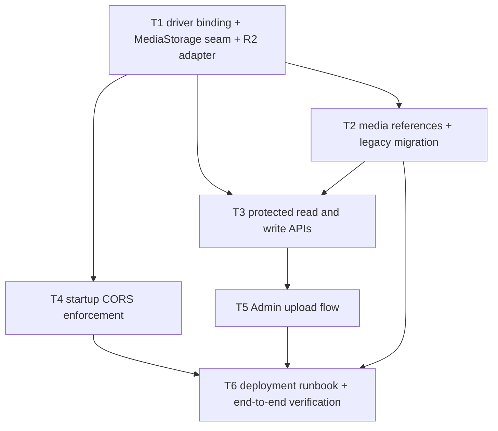

# 私有媒体读取实施计划

**Branch:** main
**Baseline SHA:** 178c1d289039fd2044f84149f132d3682dd5cdf0
**Worktree Path:** /home/yangyang/workspace/codes/YoungerYang/secret-space
**Started At:** 2026-07-19
**Updated At:** 2026-07-19

**Goal:** 将私密媒体读取改为通过 `MediaStorage` 签发的短期 URL，并用供应商无关的 `media://<logical-key>` 持久化引用。
**Architecture:** Server 通过 `MediaStorage` seam 提供签名、确认、删除与错误映射，当前由 `R2MediaStorage` adapter 实现。照片、相册和页面只保存逻辑媒体引用；角色校验通过后才向浏览器返回短期读取 URL。
**Tech Stack:** Node.js 22、TypeScript、NestJS 10、Prisma 5、AWS SDK S3 3.637、Vitest 2、Vue 3、Element Plus。
**Commit Mode:** per-task
**Batch Commit Tasks:** null
**Batch Commit Reason:** null
**Effective Execution Mode:** serial
**Final Record Mode:** terminal-exception

## Global Constraints

- 不修改 `docs/brainstorm.md`、`docs/roadmap.md`、`docs/tech-stack.md` 和 `docs/active/0.1.0/p0-engineering-base/`、`p1-map-photos/`、`p2-album/` 下的冻结文档。
- 持久化媒体引用必须是 `media://<logical-key>`；不得含 bucket、域名、R2、S3、OSS 或其他供应商标识。
- 读取签名固定为 300 秒，上传签名固定为 600 秒；匿名受保护读取始终返回 401。
- 只允许 JPEG、PNG、WebP；确认阶段限制对象 ≤10 MiB，并校验最多前 4 KiB 的 magic bytes。
- R2 是当前 adapter，业务模块与 Vue 应用不得读取 `R2_*` 环境变量或 AWS SDK 类型。
- CORS 只允许精确配置的 Origin，禁止 `*`；生产缺少 `STORAGE_DRIVER`、当前 driver 配置或允许 Origin 时拒绝启动。
- 保留 DR-003 的 JWT 会话迁移、DR-002 的删除重试和 DR-005 的相册模板不变量，不在本计划实现。
- 全仓 `pnpm test` 当前因 DR-009 的 5 个既有 `SceneManager` mock 失败而退出 1；本计划不得修改这些测试。每个任务运行声明的定向测试与构建，并在最终记录该独立基线。

## Dependency Graph

| Task | 依赖 | 可并行组 |
|---|---|---|
| T1 | 无 | A |
| T2 | T1 | B |
| T3 | T1、T2 | C |
| T4 | T1 | B |
| T5 | T3 | D |
| T6 | T2、T4、T5 | E |

---

### T1: 建立 driver 绑定的 MediaStorage seam 与当前 R2 adapter

**Depends on:** 无

**Files:**
- Create: `packages/server/src/media/media-storage.ts`
- Create: `packages/server/src/media/r2-media-storage.ts`
- Create: `packages/server/src/media/media.module.ts`
- Create: `packages/server/src/media/__tests__/r2-media-storage.test.ts`
- Create: `packages/server/src/media/__tests__/media.module.test.ts`
- Create: `packages/server/src/config/storage-config.ts`
- Create: `packages/server/src/config/__tests__/storage-config.test.ts`
- Modify: `packages/server/src/r2/r2.module.ts`
- Modify: `packages/server/src/r2/r2.service.ts`
- Modify: `packages/server/src/photo/photo.module.ts`
- Modify: `packages/server/src/album/album.module.ts`

**Interfaces:**
- Consumes: none
- Produces: `export const MEDIA_STORAGE: unique symbol`; `export interface MediaStorage { presignPhotoUpload(provinceCode: string, ext: ImageExtension, contentType: ImageContentType): Promise<UploadGrant>; presignAlbumUpload(ext: ImageExtension, contentType: ImageContentType): Promise<UploadGrant>; confirmUpload(key: string): Promise<ConfirmedUpload>; presignRead(key: string): Promise<string>; delete(key: string): Promise<void> }`; `loadStorageConfig(env: NodeJS.ProcessEnv): StorageConfig`; `MediaModule` 的 `useFactory` 按 `STORAGE_DRIVER` 将 `MEDIA_STORAGE` 绑定到当前唯一支持的 `R2MediaStorage`。

**Behavior:**
把所有对象存储能力集中到 `MediaStorage`，使业务模块只操作 logical key。`MediaModule` 的 factory 先验证 `STORAGE_DRIVER` 和当前 driver 配置，当前只允许 `r2` 并将 token 绑定到 `R2MediaStorage`；未来只在该 factory 加入新的 adapter。当前 adapter 使用 R2 完成签名、对象确认和删除，但不向调用方泄露 AWS SDK 或 R2 配置。

**Acceptance Criteria:**
- [ ] 照片上传 key 只能为 `photos/<provinceCode>/...`，相册上传 key 只能为 `photos/album/...`，PUT 签名有效期为 600 秒。
- [ ] GET 签名有效期为 300 秒；确认只接受 JPEG、PNG、WebP 的对应 magic bytes，并对伪造 Content-Type、超过 10 MiB 或不存在对象返回 422 且不返回 `mediaRef` 或读取 URL。
- [ ] 定向单元测试通过，并证明 `PhotoModule`、`AlbumModule` 依赖 `MEDIA_STORAGE` 而非 `R2Service`。
- [ ] `STORAGE_DRIVER=r2` 唯一绑定 `R2MediaStorage`；未知 driver、缺少当前 driver 变量或包含 `*` 的允许 Origin 均在启动前校验失败且错误不泄露凭据。

**Execution:**
- **Status:** pending
- **Commit SHA:** null
- **Attempts:** 0
- **Blocked Reason:** null
- **Red Result:** null
- **Verify Result:** null
- **AC Result:** null

**Task Completion Gate:**
- [ ] Red Result exists and passed
- [ ] Verify Result exists and passed
- [ ] AC Result: 4/4 passed; any deferred item has a user-approved reason recorded
- [ ] Commit SHA belongs to this task only
- [ ] Per-task AC checkbox synced

**Step 1: Red**

在 `r2-media-storage.test.ts` 先覆盖照片/相册 key、GET/PUT 过期时间、缺失对象、JPEG/PNG/WebP magic bytes、伪造 Content-Type 与超过 10 MiB；在 `storage-config.test.ts` 覆盖 r2 绑定、未知 driver、缺少变量与通配 Origin；在 `media.module.test.ts` 断言 `PhotoModule`、`AlbumModule` 导入 `MediaModule` 且业务 service 通过 `MEDIA_STORAGE` 注入。测试应因 seam 与配置 factory 尚不存在失败。

Run: `COREPACK_HOME=/tmp/secret-space-corepack TMPDIR=/tmp TMP=/tmp TEMP=/tmp pnpm --filter @secret-space/server test -- src/media/__tests__/r2-media-storage.test.ts src/media/__tests__/media.module.test.ts src/config/__tests__/storage-config.test.ts`
Expected: **FAIL** — 缺少 MediaStorage seam 或接口行为。

**Step 2: Green**

实现 `loadStorageConfig` 与 `MediaModule` 的 `useFactory`，仅将 `STORAGE_DRIVER=r2` 绑定为 `R2MediaStorage`；原 R2 代码只保留为 adapter 实现或兼容迁移壳。实现 `MediaStorage` 后所有 module provider 导出同一个 token。确认对象时读取元数据和最多 4 KiB 内容，稍后的 T3 再将其暴露为 HTTP 接口。

**Step 3: Verify**

Run: `COREPACK_HOME=/tmp/secret-space-corepack TMPDIR=/tmp TMP=/tmp TEMP=/tmp pnpm --filter @secret-space/server test -- src/media/__tests__/r2-media-storage.test.ts src/media/__tests__/media.module.test.ts src/config/__tests__/storage-config.test.ts`
Expected: **PASS**

**AC Verification:**
- AC1: 单测断言 `photos/hunan/`、`photos/album/`、300 秒和 600 秒 → 通过。
- AC2: 单测断言三种 magic bytes、伪造类型、超限和缺失对象分别符合成功/422 与无返回引用 → 通过。
- AC3: `media.module.test.ts` 断言 `PhotoModule`、`AlbumModule` 导入 `MediaModule`，且 `PhotoService`、`AlbumService` 的 Nest 注入 token 为 `MEDIA_STORAGE` → 通过。
- AC4: 单测断言 r2 factory 绑定与非法 driver/config 失败且错误不含 secret；`pnpm --filter @secret-space/server build` → 退出 0。

**Step 4: Commit**

格式：`feat(media): 建立私有媒体存储适配层`。仅提交本任务声明的文件，并用 `git diff-tree --no-commit-id --name-only -r <TASK_SHA>` 验证归属。

---

### T2: 实现媒体引用与历史引用迁移

**Depends on:** T1

**Files:**
- Create: `packages/server/src/media/media-reference.service.ts`
- Create: `packages/server/src/media/__tests__/media-reference.service.test.ts`
- Create: `packages/server/src/media/__tests__/migrate-legacy-media-refs.test.ts`
- Create: `packages/server/scripts/migrate-legacy-media-refs.ts`
- Modify: `packages/server/package.json`
- Modify: `packages/server/src/media/media.module.ts`

**Interfaces:**
- Consumes: `MEDIA_STORAGE: MediaStorage` from T1
- Produces: `export type MediaReference = \`media://${string}\``; `export class MediaReferenceService { fromMediaRef(input: string, allowedPrefixes: string[]): MediaReference; toLogicalKey(reference: MediaReference, allowedPrefixes: string[]): string; fromLegacyUrl(input: string, allowedPrefixes: string[]): MediaReference }`

**Behavior:**
只允许保存供应商无关的 `media://` 引用，拒绝 URL、bucket 和错误前缀。迁移脚本将当前 R2 旧地址转换为 logical key，在 dry-run 发现任一坏记录时阻断私有化发布。

**Acceptance Criteria:**
- [ ] 规范 `media://photos/hunan/x.webp` 可解析；`r2://`、HTTP URL、路径穿越和错误前缀均返回 400。
- [ ] `media:migrate-legacy-refs -- --dry-run` 输出各实体统计和失败记录标识；有失败时以非零退出且不改数据库。
- [ ] `--apply` 在事务中写入 `media://` 并记录 `media_reference_migration_v1`；重复执行不改变已迁移记录。

**Execution:**
- **Status:** pending
- **Commit SHA:** null
- **Attempts:** 0
- **Blocked Reason:** null
- **Red Result:** null
- **Verify Result:** null
- **AC Result:** null

**Task Completion Gate:**
- [ ] Red Result exists and passed
- [ ] Verify Result exists and passed
- [ ] AC Result: 3/3 passed; any deferred item has a user-approved reason recorded
- [ ] Commit SHA belongs to this task only
- [ ] Per-task AC checkbox synced

**Step 1: Red**

先写引用解析单测和迁移脚本的 test database dry-run 测试，分别覆盖合法旧 URL、未知 origin 和重复 apply；它们应因服务与 script 不存在失败。

Run: `COREPACK_HOME=/tmp/secret-space-corepack TMPDIR=/tmp TMP=/tmp TEMP=/tmp pnpm --filter @secret-space/server test -- src/media/__tests__/media-reference.service.test.ts src/media/__tests__/migrate-legacy-media-refs.test.ts`
Expected: **FAIL** — 缺少引用验证与迁移命令。

**Step 2: Green**

实现纯引用解析；迁移脚本只使用 `R2_LEGACY_PUBLIC_URL` 解析历史地址，dry-run 不写入，apply 用 Prisma transaction 写入并记录 Config。脚本不调用 MediaStorage 网络操作。

**Step 3: Verify**

Run: `COREPACK_HOME=/tmp/secret-space-corepack TMPDIR=/tmp TMP=/tmp TEMP=/tmp pnpm --filter @secret-space/server test -- src/media/__tests__/media-reference.service.test.ts src/media/__tests__/migrate-legacy-media-refs.test.ts`
Expected: **PASS**

**AC Verification:**
- AC1: 单测覆盖 `media://` 与拒绝 provider/URL 输入 → 通过。
- AC2: `migrate-legacy-media-refs.test.ts` 断言 dry-run 无写入、失败非零、apply 幂等 → 通过。
- AC3: `pnpm --filter @secret-space/server build` → 退出 0。

**Step 4: Commit**

格式：`feat(media): 规范化媒体引用并支持历史迁移`。仅提交本任务声明的文件，并验证 commit 文件归属。

---

### T3: 接入受保护读取、确认上传与领域写入

**Depends on:** T1、T2

**Files:**
- Create: `packages/server/src/media/media.controller.ts`
- Create: `packages/server/src/media/dto/confirm-media.dto.ts`
- Modify: `packages/server/src/media/media.module.ts`
- Modify: `packages/server/src/photo/dto/photo.dto.ts`
- Modify: `packages/server/src/photo/photo.controller.ts`
- Modify: `packages/server/src/photo/photo.service.ts`
- Modify: `packages/server/src/province/province.service.ts`
- Modify: `packages/server/src/album/dto/album.dto.ts`
- Modify: `packages/server/src/album/album.controller.ts`
- Modify: `packages/server/src/album/album.service.ts`
- Modify: `packages/server/src/photo/__tests__/photo-admin.controller.test.ts`
- Modify: `packages/server/src/province/__tests__/province.controller.test.ts`
- Modify: `packages/server/src/album/__tests__/album.controller.test.ts`
- Modify: `packages/server/src/__tests__/album-flow.e2e.test.ts`

**Interfaces:**
- Consumes: `MediaStorage.confirmUpload(key: string): Promise<ConfirmedUpload>` from T1; `MediaReferenceService.fromMediaRef(input: string, allowedPrefixes: string[]): MediaReference` from T2
- Produces: `POST /media/confirm { key: string } -> ConfirmedUpload`; `POST /photos { provinceCode: string; mediaRef: MediaReference; annotation?: string; order: number }`; `POST /albums/:id/pages { content.images: MediaReference[] }`; `PUT /pages/:id { content.images: MediaReference[] }`; album writes use `coverRef?: MediaReference`. Existing paths remain unchanged; only persisted URL fields become references.

**Behavior:**
管理员确认上传后才能保存媒体引用。照片、省份、相册和页面读取只在现有角色校验通过后，把持久化 `media://` 引用转换为 300 秒读取 URL；匿名或失效会话不会得到任何媒体地址。

**Acceptance Criteria:**
- [ ] `POST /media/confirm`、预签名、照片/相册写入仅允许管理员；访客得到 403，非法对象得到 422。
- [ ] 匿名照片和相册读取返回 401；访客、所有者、管理员读取同一媒体时返回短期 URL，持久记录保持 `media://`。
- [ ] 相册空封面/空图片不签名，未知或含 provider 信息的引用返回 400，旧 URL 只可由迁移工具处理。
- [ ] 无照片省份返回 200、空数组且零媒体 URL；过期或失效会话读取相册列表和页面均返回 401，且不会触发新签名。

**Execution:**
- **Status:** pending
- **Commit SHA:** null
- **Attempts:** 0
- **Blocked Reason:** null
- **Red Result:** null
- **Verify Result:** null
- **AC Result:** null

**Task Completion Gate:**
- [ ] Red Result exists and passed
- [ ] Verify Result exists and passed
- [ ] AC Result: 4/4 passed; any deferred item has a user-approved reason recorded
- [ ] Commit SHA belongs to this task only
- [ ] Per-task AC checkbox synced

**Step 1: Red**

先扩展现有 Supertest：`/media/confirm`、四种读取身份、`media://` 持久化、相册空值、无照片省份和过期/失效会话。测试应因接口、DTO 与序列化尚未实现失败。

Run: `COREPACK_HOME=/tmp/secret-space-corepack TMPDIR=/tmp TMP=/tmp TEMP=/tmp pnpm --filter @secret-space/server test -- src/photo/__tests__/photo-admin.controller.test.ts src/province/__tests__/province.controller.test.ts src/album/__tests__/album.controller.test.ts src/__tests__/album-flow.e2e.test.ts`
Expected: **FAIL** — 新 API 和私有媒体断言尚不存在。

**Step 2: Green**

实现受 RolesGuard 保护的确认端点。DTO 改为 `mediaRef`/`coverRef`，服务端先验证引用和前缀再持久化；读取路径在返回前批量转换引用，不把 `media://`、legacy URL 或 provider 配置返回给浏览器。

**Step 3: Verify**

Run: `COREPACK_HOME=/tmp/secret-space-corepack TMPDIR=/tmp TMP=/tmp TEMP=/tmp pnpm --filter @secret-space/server test -- src/photo/__tests__/photo-admin.controller.test.ts src/province/__tests__/province.controller.test.ts src/album/__tests__/album.controller.test.ts src/__tests__/album-flow.e2e.test.ts`
Expected: **PASS**

**AC Verification:**
- AC1: Supertest 断言匿名 401、访客/所有者/管理员 200、写入越权 403 → 通过。
- AC2: 测试数据库查询断言持久值只含 `media://`，HTTP 响应只含签名 URL → 通过。
- AC3: Supertest 断言相册空封面/空图片不调用签名，且 provider/旧 URL 保存输入为 400 → 通过。
- AC4: Supertest 断言无照片省份为 200/`[]`/零 URL；失效会话的相册和页面为 401 且 storage double 的签名调用次数为 0 → 通过。
- Build: `pnpm --filter @secret-space/server build` → 退出 0。

**Step 4: Commit**

格式：`feat(api): 接入私有媒体读取与确认上传`。仅提交本任务声明的文件，并验证 commit 文件归属。

---

### T4: 接入启动时精确 CORS enforcement

**Depends on:** T1

**Files:**
- Modify: `packages/server/src/main.ts`
- Modify: `packages/server/.env.example`
- Modify: `packages/server/.env.test`

**Interfaces:**
- Consumes: `loadStorageConfig(env: NodeJS.ProcessEnv): StorageConfig` and the validated `StorageConfig` from T1
- Produces: `export function configureCors(app: INestApplication, config: StorageConfig): void`

**Behavior:**
把 T1 已验证的 storage 配置接入真实启动路径，并用其中的精确 Origin 配置 Nest CORS。当前 R2 adapter 的浏览器直传仅允许后台 Origin 和 PUT；未知 Origin 与通配符配置被拒绝。

**Acceptance Criteria:**
- [ ] `main.ts` 在监听端口前调用 T1 的配置加载器；缺少 `STORAGE_DRIVER`、当前 driver 所需变量或任一允许 Origin 时，生产启动失败且不打印凭据。
- [ ] 包含 `*` 的 API/R2 Origin 配置被拒绝；精确 Origin 仅启用预期方法和 `Authorization`、`Content-Type` 头。
- [ ] `.env.example` 说明当前 R2 adapter 配置，但业务接口和持久化引用不含 `R2_*`。

**Execution:**
- **Status:** pending
- **Commit SHA:** null
- **Attempts:** 0
- **Blocked Reason:** null
- **Red Result:** null
- **Verify Result:** null
- **AC Result:** null

**Task Completion Gate:**
- [ ] Red Result exists and passed
- [ ] Verify Result exists and passed
- [ ] AC Result: 3/3 passed; any deferred item has a user-approved reason recorded
- [ ] Commit SHA belongs to this task only
- [ ] Per-task AC checkbox synced

**Step 1: Red**

扩展 T1 已创建的配置单测和启动集成测试，覆盖 `main.ts` 调用加载器、精确 Origin 的 CORS policy 与未知 Origin；它们应因启动路径尚未接入失败。

Run: `COREPACK_HOME=/tmp/secret-space-corepack TMPDIR=/tmp TMP=/tmp TEMP=/tmp pnpm --filter @secret-space/server test -- src/config/__tests__/storage-config.test.ts src/__tests__/app.e2e.test.ts`
Expected: **FAIL** — 缺少启动配置验证。

**Step 2: Green**

由 `main.ts` 调用 T1 的配置加载器并配置 Nest CORS；把 R2 CORS 的可操作配置说明写入 `.env.example`，测试环境维持本地 adapter mock 所需变量。不要把 CORS 逻辑散落到 controller。

**Step 3: Verify**

Run: `COREPACK_HOME=/tmp/secret-space-corepack TMPDIR=/tmp TMP=/tmp TEMP=/tmp pnpm --filter @secret-space/server test -- src/config/__tests__/storage-config.test.ts src/__tests__/app.e2e.test.ts`
Expected: **PASS**

**AC Verification:**
- AC1: 单测验证缺失/通配符配置均失败且错误不含 secret 值 → 通过。
- AC2: 单测验证精确 Origin 的 CORS policy → 通过。
- AC3: `pnpm --filter @secret-space/server build` → 退出 0。

**Step 4: Commit**

格式：`feat(config): 校验媒体存储与跨域配置`。仅提交本任务声明的文件，并验证 commit 文件归属。

---

### T5: 适配两端的确认上传与短期媒体 URL 消费

**Depends on:** T3

**Files:**
- Create: `packages/admin/src/views/__tests__/PhotoManage.test.ts`
- Create: `packages/admin/src/views/__tests__/AlbumList.test.ts`
- Create: `packages/admin/src/views/__tests__/PageEditor.test.ts`
- Modify: `packages/client/src/components/__tests__/PhotoPanel.test.ts`
- Modify: `packages/client/src/components/__tests__/AlbumViewer.test.ts`
- Modify: `packages/admin/src/views/PhotoManage.vue`
- Modify: `packages/admin/src/views/AlbumList.vue`
- Modify: `packages/admin/src/views/PageEditor.vue`

**Interfaces:**
- Consumes: `POST /media/confirm { key: string } -> { mediaRef: string; readUrl: string; readExpiresIn: 300 }` from T3
- Produces: `uploadAndConfirm(file: File, scope: 'photo' | 'album'): Promise<{ mediaRef: string; readUrl: string }>` in each managed upload flow

**Behavior:**
后台先请求上传凭据、上传文件、确认对象，再把 `mediaRef` 提交给照片、封面或页面保存接口。后台预览与前台 `PhotoPanel`、`AlbumViewer` 都只消费服务端返回的短期 URL；它们不读取或提交 `publicUrl`。

**Acceptance Criteria:**
- [ ] 照片、封面、页面图片三条上传路径均按 presign → PUT → confirm → save 顺序调用，并只保存 `mediaRef`。
- [ ] 管理后台预览使用 `readUrl`；请求体和 Pinia/Vue state 不包含 `publicUrl` 或 `r2://`。
- [ ] 对确认失败显示错误且不发出创建/更新请求。
- [ ] Client 的照片面板和相册查看器将受保护 API 返回的短期 URL 传给图片元素，不自行生成或持久化 URL。

**Execution:**
- **Status:** pending
- **Commit SHA:** null
- **Attempts:** 0
- **Blocked Reason:** null
- **Red Result:** null
- **Verify Result:** null
- **AC Result:** null

**Task Completion Gate:**
- [ ] Red Result exists and passed
- [ ] Verify Result exists and passed
- [ ] AC Result: 4/4 passed; any deferred item has a user-approved reason recorded
- [ ] Commit SHA belongs to this task only
- [ ] Per-task AC checkbox synced

**Step 1: Red**

为三张管理页写 Vue 单测：mock `UploadGrant` 与确认响应，断言保存请求不含预览 URL；同时扩展 Client 组件测试，断言受保护 API 的短期 URL 被传入图片元素。测试应因当前实现使用 `publicUrl` 或旧数据契约失败。

Run: `COREPACK_HOME=/tmp/secret-space-corepack TMPDIR=/tmp TMP=/tmp TEMP=/tmp pnpm --filter @secret-space/admin test -- src/views/__tests__/PhotoManage.test.ts src/views/__tests__/AlbumList.test.ts src/views/__tests__/PageEditor.test.ts && COREPACK_HOME=/tmp/secret-space-corepack TMPDIR=/tmp TMP=/tmp TEMP=/tmp pnpm --filter @secret-space/client test -- src/components/__tests__/PhotoPanel.test.ts src/components/__tests__/AlbumViewer.test.ts`
Expected: **FAIL** — 当前上传流程未确认对象。

**Step 2: Green**

以最小本地状态保存 `mediaRef` 与 `readUrl` 的不同职责：前者提交，后者预览。前台继续透传 API 返回的短期 URL 给图片元素。保留原有压缩、排序和编辑行为，不改动模板渲染或会话存储。

**Step 3: Verify**

Run: `COREPACK_HOME=/tmp/secret-space-corepack TMPDIR=/tmp TMP=/tmp TEMP=/tmp pnpm --filter @secret-space/admin test -- src/views/__tests__/PhotoManage.test.ts src/views/__tests__/AlbumList.test.ts src/views/__tests__/PageEditor.test.ts && COREPACK_HOME=/tmp/secret-space-corepack TMPDIR=/tmp TMP=/tmp TEMP=/tmp pnpm --filter @secret-space/client test -- src/components/__tests__/PhotoPanel.test.ts src/components/__tests__/AlbumViewer.test.ts`
Expected: **PASS**

**AC Verification:**
- AC1: 三个单测断言精确请求顺序和 `mediaRef` 保存 → 通过。
- AC2: 三个单测断言 confirm 失败时不保存 → 通过。
- AC3: `pnpm --filter @secret-space/admin build` → 退出 0。
- AC4: Client 组件测试断言短期 URL 直接成为图片 `src`，且不构造 provider URL → 通过。

**Step 4: Commit**

格式：`feat(admin): 使用确认后的私有媒体引用`。仅提交本任务声明的文件，并验证 commit 文件归属。

---

### T6: 完成迁移运行手册与跨层验收

**Depends on:** T2、T4、T5

**Files:**
- Create: `docs/active/0.1.0/remediation/dr-001-private-media/deployment-checklist.md`
- Modify: `docs/active/0.1.0/remediation/worklog.md`
- Test: `packages/server/src/__tests__/app.e2e.test.ts`
- Test: `packages/server/src/__tests__/album-flow.e2e.test.ts`

**Interfaces:**
- Consumes: `media:migrate-legacy-refs -- --dry-run|--apply` from T2; `loadStorageConfig(env: NodeJS.ProcessEnv): StorageConfig` from T1（由 T4 接入启动路径）；Admin confirmed-upload flow from T5
- Produces: `deployment-checklist.md § "R2 private access, CORS, migration, rollback, provider switch"`

**Behavior:**
把私有桶、精确 CORS、历史引用迁移、SQLite 回滚和未来 provider 双读切换写成可执行部署清单。跨层验收确认授权 API、Admin 保存与迁移工具共同遵守 `media://` 契约。

**Acceptance Criteria:**
- [ ] 清单包含运行前备份、dry-run 零失败门槛、R2 CORS OPTIONS 验收、匿名直连非 2xx、apply、回滚和 30 天 provider 回退步骤。
- [ ] Server 集成测试验证匿名无法获得媒体 URL，授权角色可以获得签名 URL，管理端保存后再次读取仍可显示媒体。
- [ ] 运行 server/admin/client 构建；根 `pnpm test` 的结果记录在工作日志，且仅保留 DR-009 已知的 5 个 SceneManager 失败。

**Execution:**
- **Status:** pending
- **Commit SHA:** null
- **Attempts:** 0
- **Blocked Reason:** null
- **Red Result:** null
- **Verify Result:** null
- **AC Result:** null

**Task Completion Gate:**
- [ ] Red Result exists and passed
- [ ] Verify Result exists and passed
- [ ] AC Result: 3/3 passed; any deferred item has a user-approved reason recorded
- [ ] Commit SHA belongs to this task only
- [ ] Per-task AC checkbox synced

**Step 1: Red**

确认部署清单不存在；随后先把跨层授权媒体流的断言写入 E2E 测试，再运行该测试，确认新断言在实现前失败。

Run: `COREPACK_HOME=/tmp/secret-space-corepack TMPDIR=/tmp TMP=/tmp TEMP=/tmp pnpm --filter @secret-space/server test -- src/__tests__/app.e2e.test.ts src/__tests__/album-flow.e2e.test.ts`
Expected: **FAIL** — 部署清单和端到端私有媒体断言尚不存在。

**Step 2: Green**

编写仅针对当前 R2 adapter 的可操作清单：配置精确 Origin、检查匿名访问、备份、dry-run、apply、回滚与 provider 切换。补齐端到端断言，不修改 DR-009 的 SceneManager 测试。

**Step 3: Verify**

Run: `COREPACK_HOME=/tmp/secret-space-corepack TMPDIR=/tmp TMP=/tmp TEMP=/tmp pnpm --filter @secret-space/server test -- src/__tests__/app.e2e.test.ts src/__tests__/album-flow.e2e.test.ts && COREPACK_HOME=/tmp/secret-space-corepack TMPDIR=/tmp TMP=/tmp TEMP=/tmp pnpm build && COREPACK_HOME=/tmp/secret-space-corepack TMPDIR=/tmp TMP=/tmp TEMP=/tmp pnpm test`
Expected: Server integration and build **PASS**; root test retains only the documented DR-009 SceneManager failures.

**AC Verification:**
- AC1: `deployment-checklist.md` 包含备份、dry-run、CORS、匿名访问、apply、回滚、provider 回退七项 → 通过。
- AC2: Server E2E 断言授权/匿名媒体行为 → 通过。
- AC3: `pnpm build` 退出 0；`pnpm test` 失败仅列出 5 个 DR-009 SceneManager mock 失败 → 记录。

**Step 4: Commit**

格式：`docs(remediation): 验收私有媒体部署流程`。仅提交本任务声明的文件，并验证 commit 文件归属。

---

## Acceptance Criteria

- [ ] AC1: 管理员上传 JPEG、PNG 或 WebP 后，经确认保存为 `media://` 引用；访客、所有者和管理员能通过受保护 API 看到 300 秒读取 URL，匿名者得到 401。
- [ ] AC2: 非管理员、伪造类型、超 10 MiB、错误文件头、未知 provider/路径引用均不能得到可保存引用或媒体读取 URL。
- [ ] AC3: 当前 R2 adapter 私有且只允许精确 Origin 上传；缺失或通配 CORS/driver 配置时服务拒绝启动。
- [ ] AC4: 历史 URL dry-run 零失败后可幂等迁移为 `media://`；未来切换 driver 不修改业务表、Client/Admin API 或逻辑媒体引用。
- [ ] AC5: 所有 DR-001 任务拥有独立 commit、定向测试和构建证据；根测试中的唯一剩余失败属于已登记的 DR-009。
