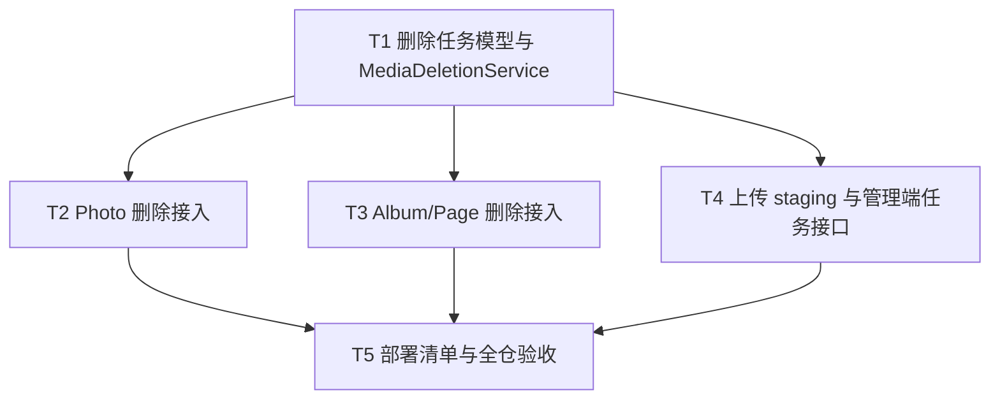

# 媒体删除闭环实施计划

**逻辑版本：** 0.1.0
**追踪项：** DR-002
**Resolved Path:** `docs/active/0.1.0/remediation/dr-002-media-deletion/`
**依据：** [spec.md](./spec.md)、[design.md](./design.md)

## Global Constraints

- 每个任务遵循 Red → Green → Verify → Commit；提交只包含本任务声明的文件。
- 验证一律使用 fresh 命令输出；全仓基线必须保持 `pnpm test` 退出码 0。
- 不引入新运行时依赖；不修改冻结基线文档。
- 删除语义变化（接口不再因存储故障返回 5xx）只在本计划任务内落地，不波及其他追踪项范围。
- 发现新问题时登记新 ID，不塞进本计划。

## Dependency Graph

T2/T3/T4 之间无相互依赖，可串行执行；T5 依赖前三者全部完成。

---

### T1: 建立 MediaDeletionTask 模型与 MediaDeletionService

**Depends on:** 无

**Files:**
- Modify: `packages/server/prisma/schema.prisma`（新增 `MediaDeletionTask` 模型）
- Create: `packages/server/prisma/migrations/*_add_media_deletion_task/migration.sql`（`prisma migrate dev` 生成）
- Create: `packages/server/src/media/media-deletion.service.ts`
- Create: `packages/server/src/media/__tests__/media-deletion.service.test.ts`
- Modify: `packages/server/src/media/media.module.ts`

**Interfaces:**
- Consumes: `MEDIA_STORAGE`、`PrismaService`
- Produces: `MediaDeletionService`（`enqueueMany(keys, tx): Promise<number>`、`runDueDeletions(limit?): Promise<{processed,succeeded,failed}>`、`onApplicationBootstrap()`），导出 `RETRY_BASE_MS` / `RETRY_MAX_MS` / `backoffMs(attempts)`；Prisma 模型 `MediaDeletionTask { id, key, status(pending|done), attempts, lastError?, nextAttemptAt, createdAt, updatedAt, doneAt? }`，索引 `(status, nextAttemptAt)`。

**Behavior:**
`enqueueMany` 在调用方事务内持久化待办任务：剔除空值、批内去重、拒绝非 `photos/` 前缀或含 `..` 的 key（记录 warn 并跳过）。`runDueDeletions` 只取 `status=pending 且 nextAttemptAt<=now` 的任务（升序、上限默认 50），逐条调用 `storage.delete`：成功则 `status=done + doneAt`；失败则 `attempts+1`、`lastError`（错误名+消息、截断、不含 URL）、`nextAttemptAt = now + min(60s×2^(attempts-1), 3600s)`；单条失败不影响其余。`onApplicationBootstrap` 发起一次清扫且绝不阻塞启动。

**Acceptance Criteria:**
- [x] AC1: `enqueueMany` 批内去重、非法 key 被跳过且可断言；任务初始 `status=pending`、`nextAttemptAt≈now`。
- [x] AC2: 存储成功路径任务转 `done` 且有 `doneAt`；失败路径任务保持 `pending`，`attempts`/`lastError` 递增、退避正确（60s→120s→…→封顶 3600s）。
- [x] AC3: `runDueDeletions` 只处理到期待办，单条失败不影响其他任务；重复执行幂等（已 done 不再处理）。
- [x] AC4: `lastError` 不包含任何 URL；迁移只增表不触碰既有数据；`pnpm --filter @secret-space/server build` 退出 0。

**Execution:**
- **Status:** done
- **Commit SHA:** 86f8623
- **Attempts:** 1
- **Blocked Reason:** null
- **Red Result:** FAIL 符合预期 — `MediaDeletionService`/`MediaDeletionTask` 不存在，目标套件无法加载（EXIT=1，其余 141 用例不受影响）
- **Verify Result:** PASS — Server 15 文件 148/148，`pnpm --filter @secret-space/server build` 退出 0（2026-07-21 WSL）
- **AC Result:** 4/4 通过（注：实现中改用逐条 `create` 替代 `createMany`，因 Prisma 5.0 SQLite 不支持后者）

**Task Completion Gate:**
- [x] Red Result exists and passed
- [x] Verify Result exists and passed
- [x] AC Result: 4/4 passed
- [x] Commit SHA belongs to this task only

**Step 1: Red**

在 `media-deletion.service.test.ts` 覆盖：enqueue 去重/非法 key/初始字段；成功 done；失败 pending+退避序列；只处理到期任务；done 任务不重处理；lastError 不含 URL。服务尚不存在，测试应无法通过编译即失败。

Run: `COREPACK_HOME=/tmp/secret-space-corepack TMPDIR=/tmp TMP=/tmp TEMP=/tmp pnpm --filter @secret-space/server test -- src/media/__tests__/media-deletion.service.test.ts`
Expected: **FAIL** — MediaDeletionService / MediaDeletionTask 不存在。

**Step 2: Green**

新增 Prisma 模型并执行 `prisma migrate dev -n add_media_deletion_task`；实现 `MediaDeletionService` 并接入 `MediaModule`（providers + exports）。

**Step 3: Verify**

Run: 同 Red 命令。Expected: **PASS**。

**AC Verification:**
- AC1/AC2/AC3: 定向测试断言 → 通过。
- AC4: 检查测试中的 lastError 断言；`git diff` 确认迁移仅含新表；`pnpm --filter @secret-space/server build` → 退出 0。

**Step 4: Commit**

格式：`feat(media): 新增媒体删除任务模型与重试服务`。仅提交本任务声明的文件，`git diff-tree --no-commit-id --name-only -r <SHA>` 验证归属。

---

### T2: Photo 删除接入同事务登记

**Depends on:** T1

**Files:**
- Modify: `packages/server/src/photo/photo.service.ts`
- Modify: `packages/server/src/photo/__tests__/photo-admin.controller.test.ts`

**Interfaces:**
- Consumes: `MediaDeletionService.enqueueMany`、`MediaDeletionService.runDueDeletions`
- Produces: `PhotoService.delete` 新语义：事务内登记任务 + 删除记录，提交后立即触发清扫；存储故障仍 204。

**Behavior:**
删除照片时取 `photo.key`（空则从 `media://` url 解析，仍失败则跳过并 warn）；`prisma.$transaction` 内先 `enqueueMany` 后 `photo.delete`；提交后 `await runDueDeletions()`（尽力而为，异常不外抛）。移除先 `storage.delete` 后删库的旧逻辑。

**Acceptance Criteria:**
- [x] AC1: 存储正常时删除返回 204，对象被删，任务 `done`。
- [x] AC2: 存储故障时删除仍返回 204，记录已删，任务 `pending` 含 `lastError`；存储恢复后经 retry 任务转 `done`。
- [x] AC3: 匿名/visitor/owner 仍 401/403；不存在 id 仍 404（既有断言保持）。
- [x] AC4: `photo.service.ts` 不再直接调用 `storage.delete`。

**Execution:**
- **Status:** done | **Commit SHA:** 32480be | **Attempts:** 1 | **Blocked Reason:** null | **Red Result:** FAIL 符合预期 — 存储故障路径返回 500 且无持久化任务（2 个新用例失败，148 通过） | **Verify Result:** PASS — Server 15 文件 150/150（2026-07-21 WSL） | **AC Result:** 4/4 通过

**Task Completion Gate:**
- [x] Red Result exists and passed
- [x] Verify Result exists and passed
- [x] AC Result: 4/4 passed
- [x] Commit SHA belongs to this task only

**Step 1: Red**

在 `photo-admin.controller.test.ts` 新增：mock storage.delete 拒绝时 DELETE 仍 204 且任务 pending；恢复后 POST `/media/deletion-tasks/retry`（T4 提供接口前可直接调服务 `runDueDeletions`）任务 done；storage.delete 被以正确 key 调用。当前实现下失败路径会 500，Red 成立。

Run: `COREPACK_HOME=/tmp/secret-space-corepack TMPDIR=/tmp TMP=/tmp TEMP=/tmp pnpm --filter @secret-space/server test -- src/photo/__tests__/photo-admin.controller.test.ts`
Expected: **FAIL** — 失败路径返回 500 且持久化任务不存在。

**Step 2: Green**

按 Behavior 改造 `PhotoService.delete`。

**Step 3: Verify**

Run: 同 Red 命令。Expected: **PASS**。

**AC Verification:**
- AC1/AC2/AC3: 定向测试断言 → 通过。
- AC4: `grep` 确认 service 无 `storage.delete` 直调；全量 server 测试不回归。

**Step 4: Commit**

格式：`fix(photo): 照片删除接入持久化任务闭环`。仅提交本任务声明的文件。

---

### T3: Album 删除与 Page 删除接入

**Depends on:** T1

**Files:**
- Modify: `packages/server/src/album/album.service.ts`
- Modify: `packages/server/src/album/__tests__/album.controller.test.ts`
- Modify: `packages/server/src/__tests__/album-flow.e2e.test.ts`

**Interfaces:**
- Consumes: `MediaDeletionService`、`MediaReferenceService.toLogicalKey`
- Produces: `AlbumService.delete` / `AlbumService.deletePage` 的同事务登记与提交后清扫。

**Behavior:**
`delete(albumId)`：从事务前的持久化数据收集 key（封面 `coverUrl` 与各页 `content.images` 中的 `media://` 引用，经 `toLogicalKey` 解析；非 `media://` 值跳过并 warn）；事务内登记任务并删除相册（Page 级联）；提交后清扫。`deletePage(pageId)`：同样登记该页图片任务后删除页面。移除 `Promise.allSettled + console` 清理与 `extractKey` URL 反解析。

**Acceptance Criteria:**
- [x] AC1: 删除相册后封面与全部页面图片各有任务记录；存储正常时全部 `done`。
- [x] AC2: 存储故障时删除仍 204，任务 `pending`；恢复后 retry 转 `done`。
- [x] AC3: 删除单页会登记其图片任务（回归断言：不再出现「页面删除后对象无任务」）。
- [x] AC4: 服务内不再存在 `extractKey` / `Promise.allSettled` 清理残迹；`album-flow.e2e` 全链路通过。

**Execution:**
- **Status:** done | **Commit SHA:** d783721 | **Attempts:** 1 | **Blocked Reason:** null | **Red Result:** FAIL 符合预期 — 无持久化任务记录（3 个新用例失败，150 通过） | **Verify Result:** PASS — Server 15 文件 153/153，extractKey/Promise.allSettled 残迹已移除（2026-07-21 WSL） | **AC Result:** 4/4 通过

**Task Completion Gate:**
- [x] Red Result exists and passed
- [x] Verify Result exists and passed
- [x] AC Result: 4/4 passed
- [x] Commit SHA belongs to this task only

**Step 1: Red**

在 `album.controller.test.ts` 新增：删除相册后任务表含封面与页图 key；mock 故障时仍 204 且任务 pending；删除单页登记其图片任务。当前实现下任务表无记录，Red 成立。

Run: `COREPACK_HOME=/tmp/secret-space-corepack TMPDIR=/tmp TMP=/tmp TEMP=/tmp pnpm --filter @secret-space/server test -- src/album/__tests__/album.controller.test.ts`
Expected: **FAIL** — 无持久化任务记录。

**Step 2: Green**

按 Behavior 改造 `AlbumService.delete` / `deletePage`。

**Step 3: Verify**

Run: `pnpm --filter @secret-space/server test -- src/album/__tests__/album.controller.test.ts src/__tests__/album-flow.e2e.test.ts`（前缀同 Red）。Expected: **PASS**。

**AC Verification:**
- AC1/AC2/AC3: 定向测试断言 → 通过。
- AC4: `grep` 确认无 `extractKey`/`Promise.allSettled`；e2e 通过。

**Step 4: Commit**

格式：`fix(album): 相册与页面删除接入持久化任务闭环`。仅提交本任务声明的文件。

---

### T4: 上传 tmp/ staging、confirm 拷贝与管理端任务接口

**Depends on:** T1

**Files:**
- Modify: `packages/server/src/media/media-storage.ts`（契约注释）
- Modify: `packages/server/src/media/r2-media-storage.ts`
- Modify: `packages/server/src/media/media.controller.ts`
- Modify: `packages/server/src/media/media-deletion.service.ts`（追加 `listTasks`）
- Create: `packages/server/src/media/__tests__/media-deletion.controller.test.ts`
- Modify: `packages/server/src/media/__tests__/r2-media-storage.test.ts`
- Modify: `packages/server/src/media/__tests__/media.module.test.ts`
- Modify: `packages/server/src/__tests__/test-utils.ts`（mock 契约同步）
- Modify: `packages/server/src/photo/__tests__/photo-admin.controller.test.ts`（presign/confirm 断言同步）
- Modify: `packages/server/src/album/__tests__/album.controller.test.ts`（presign/confirm 断言同步）
- Modify: `packages/server/src/__tests__/album-flow.e2e.test.ts`（断言同步）

**Interfaces:**
- Produces: presign 返回 `tmp/photos/...` key；`POST /media/confirm` 仅接受 `tmp/photos/` 前缀，完成 `CopyObject → photos/... → 删 tmp` 后返回 `media://photos/...`；`GET /api/media/deletion-tasks?status=pending|done|failing`（admin）；`POST /api/media/deletion-tasks/retry`（admin）。

**Behavior:**
`presignPhotoUpload`/`presignAlbumUpload` 生成 `tmp/` 前缀 key；`confirmUpload` 校验后拷贝至去掉 `tmp/` 的最终 key 并删除 tmp 对象；确认接口的 key 校验改为 `tmp/photos/`。`MediaDeletionService` 追加 `listTasks(status?, take=100)`，`failing = pending 且 attempts>0`；`MediaController` 新增两个 admin 端点，鉴权沿用 RolesGuard（匿名 401、visitor/owner 403）。

**Acceptance Criteria:**
- [x] AC1: presign key 带 `tmp/` 前缀；confirm 后返回的 `mediaRef` 不含 `tmp/`，且 R2 调用顺序为 HeadObject→GetObject→CopyObject→DeleteObject。
- [x] AC2: 非 `tmp/photos/` key 的 confirm 返回 400；拷贝失败返回 422 且不返回 mediaRef/readUrl。
- [x] AC3: 任务列表/重试接口匿名 401、visitor/owner 403、admin 200；列表字段含 key/status/attempts/lastError/nextAttemptAt/doneAt；retry 返回 `{processed,succeeded,failed}`。
- [x] AC4: 受影响既有测试全部更新并通过；全仓 server 测试退出码 0。

**Execution:**
- **Status:** done | **Commit SHA:** dccf2a0 | **Attempts:** 1 | **Blocked Reason:** null | **Red Result:** FAIL 符合预期 — 端点不存在、tmp staging 行为未实现（19 用例失败，145 通过） | **Verify Result:** PASS — Server 16 文件 164/164，server build 退出 0（2026-07-21 WSL） | **AC Result:** 4/4 通过

**Task Completion Gate:**
- [x] Red Result exists and passed
- [x] Verify Result exists and passed
- [x] AC Result: 4/4 passed
- [x] Commit SHA belongs to this task only

**Step 1: Red**

新增 `media-deletion.controller.test.ts`（401/403/200、字段、retry 汇总）；`r2-media-storage.test.ts` 断言 tmp key 与 Copy/Delete 顺序；现有 presign/confirm 相关断言改为 tmp 契约。实现未改前 Red 成立。

Run: `COREPACK_HOME=/tmp/secret-space-corepack TMPDIR=/tmp TMP=/tmp TEMP=/tmp pnpm --filter @secret-space/server test -- src/media/__tests__/`
Expected: **FAIL** — 端点不存在、tmp 行为未实现。

**Step 2: Green**

改造 `r2-media-storage`、`media.controller`、`media-deletion.service.listTasks`，同步 test-utils mock。

**Step 3: Verify**

Run: `pnpm --filter @secret-space/server test`（前缀同 Red）。Expected: **PASS**。

**AC Verification:**
- AC1/AC2: r2-media-storage 定向断言 → 通过。
- AC3: 控制器定向断言 → 通过。
- AC4: server 全量测试退出码 0。

**Step 4: Commit**

格式：`feat(media): 上传 staging 隔离与删除任务管理端接口`。仅提交本任务声明的文件。

---

### T5: 部署清单追加与全仓验收

**Depends on:** T2、T3、T4

**Files:**
- Modify: `docs/active/0.1.0/remediation/dr-001-private-media/deployment-checklist.md`（追加 DR-002 lifecycle 规则节）
- Modify: `docs/active/0.1.0/remediation/tracker.md`（DR-002 状态收口）
- Modify: `docs/active/0.1.0/remediation/worklog.md`（实施与验收记录）

**Behavior:**
部署清单追加「R2 生命周期规则：`tmp/` 前缀对象 1 天后过期」配置与 curl 验证步骤；执行全仓构建与测试作为跨层验收；按规则收口 tracker 与 worklog。

**Acceptance Criteria:**
- [x] AC1: 部署清单包含 tmp/ lifecycle 规则与验证命令。
- [x] AC2: WSL 内 `pnpm build` 与 `pnpm test` 均退出 0（fresh 输出入 worklog）。
- [x] AC3: DR-002 完成标准逐项可判定通过。

**Execution:**
- **Status:** done | **Commit SHA:** 见本任务收口提交（git log 顶部） | **Attempts:** 1 | **Blocked Reason:** null | **Red Result:** 不适用（文档与验收收口任务） | **Verify Result:** PASS — WSL 全仓 `pnpm test` 退出 0（Server 164/164、Admin 11/11、Client 36/36、Shared 1/1，合计 212/212）；`pnpm build` 退出 0（2026-07-21） | **AC Result:** 3/3 通过

**Task Completion Gate:**
- [x] Verify Result exists and passed
- [x] AC Result: 3/3 passed
- [x] Commit SHA belongs to this task only

**Step 4: Commit**

格式：`docs(remediation): DR-002 部署清单与验收收口`。仅提交本任务声明的文件。

---

## Acceptance Criteria（计划级）

- [x] 规格 5 个 Behavior 的正常与失败路径均有测试证据，全仓测试基线保持绿色。
- [x] 删除任务全程不丢失（事务登记 + 持久化重试 + 启动清扫 + 管理端触发）。
- [x] 失败可查询（管理端列表），任务 key 只来自持久化引用。
- [x] 未确认上传对象经 tmp/ 前缀由桶级 lifecycle 清除，部署项入清单。
