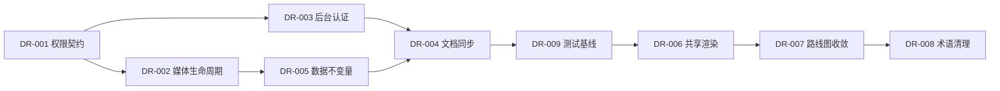

# 0.1.0 整体方案设计审查与修复追踪

> 审查日期：2026-07-18
> 审查范围：全局创意、技术栈、路线图，P0/P1/P2 的 Spec–Design–Plan，以及当前实现的一致性
> 审查深度：standard
> 当前结论：FAIL（核心架构可保留，需先关闭阻塞项和重要项）

## 结论摘要

整体技术方向合理，无需推倒重来。单房间加局部 Zoom-in 的产品骨架清晰；PixiJS 负责场景、Vue 负责富内容的分层已经通过 Spike 和实际模块验证；pnpm monorepo、NestJS、SQLite、R2 也符合当前规模。

当前主要风险不在技术选型，而在以下方面：

1. 隐私读取契约在文档之间冲突。
2. 对象存储删除缺少可恢复的一致性闭环。
3. 管理员认证强度与内容敏感度不匹配。
4. Plan 状态和实际代码已经失真，且缺少逐任务验收标准。
5. 相册模型没有完整表达模板、顺序和媒体归属约束。
6. 长期路线图规模偏大，性能与隐私等横切能力安排过晚。

## 评分

| 维度 | 分数 | 结论 |
|---|---:|---|
| 产品愿景与可行性 | 4/5 | 房间空间隐喻清晰，功能可自然扩展 |
| 架构完整性 | 4/5 | Canvas 场景层与 DOM 内容层分工合理 |
| 跨文档正确性 | 2/5 | 权限、接口返回、阶段状态存在明显冲突 |
| 安全与隐私 | 2/5 | 对家庭照片和儿童内容而言边界不够强 |
| 数据与接口精确度 | 3/5 | 主路径完整，媒体生命周期和页面约束不足 |
| 计划可执行性 | 2/5 | 计划状态过时，缺少逐任务 AC |
| 测试证据 | 3/5 | 服务端稳定，但全仓测试未通过 |

加权评分约为 **2.8/5.0**。

## 修复队列

状态值统一使用：`open`、`in-progress`、`blocked`、`verified`。

| ID | 优先级 | 状态 | 问题 | 完成标准 |
|---|---|---|---|---|
| DR-001 | P0 | open | 隐私读取契约冲突 | 建立角色×资源×操作权限矩阵；P0/P1/P2 文档一致；所有内容读取 API 有鉴权集成测试；明确 R2 读权限策略 |
| DR-002 | P1 | open | 媒体删除无可靠闭环 | 媒体保存稳定 `storageKey`；删除失败可持久化重试；失败不会静默丢失；有失败路径测试与可观测记录 |
| DR-003 | P1 | open | 管理员 JWT 长期存放在 localStorage | 明确后台会话方案；管理员令牌不再暴露给页面脚本；会话过期、撤销、未认证和越权路径均有测试 |
| DR-004 | P1 | open | Plan 与实际实现失真 | P0/P1/P2 Execution 状态和 Commit SHA 准确；每个 Task 至少包含业务 AC 与验证 AC；已完成阶段有明确归档决策 |
| DR-005 | P1 | open | 相册模型缺少业务不变量 | 服务端校验模板与图片数量/文字要求；同相册顺序规则明确；媒体 URL/key 归属可验证；异常与并发路径有测试 |
| DR-006 | P2 | open | Admin 与 Client 重复维护相册模板渲染 | 抽取单一模板渲染核心；两端消费同一实现；预览一致性有组件或 E2E 验证 |
| DR-007 | P2 | open | 49 个 milestone 缺少阶段门槛 | P3+ 改为候选 backlog；每期有 go/no-go 指标；性能、隐私、备份恢复前移为横切验收项 |
| DR-008 | P2 | open | 项目术语不一致 | 清除“情侣私密空间”等错误上下文；建立角色、空间、内容类型的统一术语表 |
| DR-009 | P1 | open | 全仓测试基线不绿 | 修复 SceneManager 测试纹理 mock；`pnpm test` 在统一临时目录配置下退出码为 0 |

## 详细发现

### DR-001：隐私读取契约冲突

`p2-album/design.md` 将 `GET /albums` 和 `GET /albums/:id/pages` 定义为无需认证；`p2-album/spec.md` 也写明读操作公开。这与项目“密码保护的私密空间”、P1 的认证读取以及当前实际路由冲突。

当前 `AlbumController` 已要求 `visitor`、`owner` 或 `admin` 角色，因此现有实现比文档安全。但文档仍可能诱导后续实现回退。R2 使用公开 URL，也需要明确链接泄露是否在可接受风险内。

### DR-002：媒体删除缺少一致性闭环

设计同时承诺“同步删除 R2 文件”和“R2 删除失败时仍提交数据库删除”。当前实现先删除数据库，再 best-effort 清理对象；`R2Service.delete` 会吞掉异常，上层无法登记重试。

这不会阻塞用户操作，但可能永久遗留不可追踪的对象。修复方案应优先采用稳定 `storageKey` 加持久化删除任务，而不是继续从公开 URL 反解析 key。

### DR-003：管理员认证边界偏弱

访客和管理员 JWT 都存放在 `localStorage`，管理员令牌有效期为七天。随着日记、语音、时间胶囊等内容进入系统，XSS 导致的令牌窃取影响会明显扩大。

至少应将后台认证迁移到 `HttpOnly`、`Secure`、`SameSite` Cookie，并补充 CSP、较短会话、撤销和登录审计策略。

### DR-004：计划无法准确反映执行状态

P0、P1、P2 三份 Plan 共 18 个 Task，但没有正式的 per-task Acceptance Criteria。P2 的 5 个 Task 仍全部标记为 `pending`，实际相册模块和测试已经存在。P1 部分 Commit SHA 仍使用 `see git log`。

修复时应以代码和 Git 历史为证据重新填写，而不是根据旧计划猜测状态。

### DR-005：相册数据模型约束不足

`Page.content` 使用字符串保存 JSON，`order` 只有普通索引。服务端尚未完整校验不同模板所需的图片数量、`photo-text` 的文字要求、媒体归属和同一相册内的顺序不变量。

这些约束必须由服务端集中执行，不能只依赖管理后台表单。

### DR-006：相册渲染存在重复实现

Admin 的预览组件和 Client 的阅读组件独立维护相同模板逻辑。两端可能随迭代产生视觉或行为差异。建议共享纯模板渲染层，保留各自的翻页外壳和管理交互。

### DR-007：路线图缺少收敛门槛

路线图包含 49 个 milestone，性能优化和 PWA 被安排到 P11。对于重图片、动画和音频项目，性能、隐私、备份恢复应从 P0 起作为每阶段验收条件，而不是最终收尾任务。

P0–P2 可以继续作为已正式化阶段；P3+ 应先保留为候选主题，只在进入下一阶段时正式编写 Spec–Design–Plan。

### DR-008：项目上下文污染

P2 Design 将项目写成“情侣私密空间”，与“果果的秘密空间”及儿童成长内容不一致。虽然不直接影响运行，但会影响角色、权限和内容敏感度判断。

### DR-009：测试基线未通过

2026-07-18 的验证结果：

- Server：8 个测试文件、44 个测试全部通过。
- Shared：1/1 通过。
- Admin：2/2 通过。
- Client：27/32 通过；`SceneManager` 的 5 个测试因纹理 mock 与当前实现不一致而失败。
- 全仓 `pnpm test` 退出码为 1。

## 推荐修复顺序

原则：一次只将一个条目标记为 `in-progress`；完成实现和验证后才能改为 `verified`。修复过程中发现的新问题另建 ID，不扩张当前条目的范围。

## 正向结论

- 单房间加局部 Zoom-in 是稳定的产品骨架。
- PixiJS 与 Vue 分层符合内容形态，已有 Spike 和实际模块证据。
- Monorepo、NestJS、SQLite 与 R2 的组合适合当前规模和部署方式。
- P0/P1/P2 已具备 Given/When/Then、接口契约、备选方案和量化 NFR 的基础。
- P1 作为首个 MVP 截止点合理，可交付完整体验。

## 关闭本报告的条件

仅当 DR-001 至 DR-009 全部达到 `verified`，重新执行整体 SDD Review 且结论至少为 `CONDITIONAL`，本报告才可归档。
