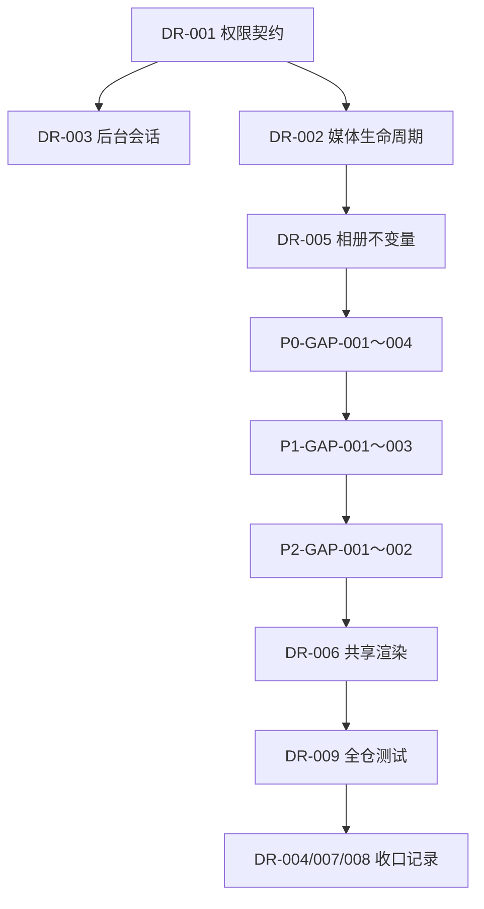

# 修复与补完追踪表

> 建立日期：2026-07-18
> 适用范围：0.1.0 的 P0～P2 既有实现
> 冻结基线：原 P0/P1/P2 文档及全局方案只读

## 汇总

| 分类 | queued | in-progress | blocked | verified | superseded | 合计 |
|---|---:|---:|---:|---:|---:|---:|
| 审查问题 | 8 | 1 | 0 | 0 | 0 | 9 |
| P0 补完 | 4 | 0 | 0 | 0 | 0 | 4 |
| P1 补完 | 3 | 0 | 0 | 0 | 0 | 3 |
| P2 补完 | 2 | 0 | 0 | 0 | 0 | 2 |
| **总计** | **17** | **1** | **0** | **0** | **0** | **18** |

## 审查问题

| ID | 优先级 | 状态 | 问题 | 完成标准 |
|---|---|---|---|---|
| DR-001 | P0 | in-progress | 隐私读取契约冲突 | 在本目录记录角色×资源×操作权限矩阵；内容读取 API 与矩阵一致；鉴权集成测试覆盖匿名、访客、所有者、管理员；明确对象存储读取策略 |
| DR-002 | P1 | queued | 媒体删除无可靠闭环 | 媒体保存稳定 `storageKey`；删除失败可持久化重试；失败有可观测记录；正常与失败路径测试通过 |
| DR-003 | P1 | queued | 管理员 JWT 长期存放在 localStorage | 管理员令牌不暴露给页面脚本；会话过期、撤销、匿名和越权路径均有测试；迁移后后台主流程可用 |
| DR-004 | P1 | queued | 旧 Plan 与实际实现失真 | 不修改旧 Plan；在本目录建立 P0～P2 实际状态快照、代码证据和验收结果；后续状态只维护于本追踪表 |
| DR-005 | P1 | queued | 相册模型缺少业务不变量 | 服务端校验模板图片数量、文字要求、媒体归属和顺序；异常与并发路径测试通过 |
| DR-006 | P2 | queued | Admin 与 Client 重复维护模板渲染 | 两端消费同一模板定义或渲染核心；预览一致性有自动化验证；重复实现移除 |
| DR-007 | P2 | queued | 长期路线缺少阶段门槛 | 不修改旧 roadmap；在本目录记录 P3+ 的 go/no-go 门槛，并把性能、隐私、备份恢复定义为横切验收项 |
| DR-008 | P2 | queued | 项目术语不一致 | 不修改旧文档；在本目录建立规范术语和错误术语映射，后续代码与新文档只使用规范术语 |
| DR-009 | P1 | queued | 全仓测试基线不绿 | 修复 SceneManager 测试与纹理 mock；全仓 `pnpm test` 退出码为 0；不得删除有效断言换取通过 |

## P0 未完成工作

| ID | 优先级 | 状态 | 未完成工作 | 完成标准 |
|---|---|---|---|---|
| P0-GAP-001 | P1 | queued | 加载页仍使用随机进度模拟 | 进度来自真实首屏资源；15 秒超时与重试可触发；开门过渡和音效完成后才进入场景；正常、失败、重试测试通过 |
| P0-GAP-002 | P1 | queued | 竖屏 Camera 未接入手势和导航 | 左右滑动切换相邻区域；显示当前位置指示器；旋转屏幕后保持区域状态；组件或 E2E 测试通过 |
| P0-GAP-003 | P1 | queued | Scene 世界坐标和适配策略偏离既有契约 | 在本目录确定唯一坐标系与 contain/cover 策略；实现、Camera 和测试使用同一契约；常见横竖屏尺寸断言通过 |
| P0-GAP-004 | P2 | queued | 环境音未接入入口流程 | 首次用户手势解锁后按当前季节播放环境音；资源失败不阻塞场景且有警告；重复触发不产生并行音轨 |

## P1 未完成工作

| ID | 优先级 | 状态 | 未完成工作 | 完成标准 |
|---|---|---|---|---|
| P1-GAP-001 | P1 | queued | 地图 Overlay 未与 Camera 变换对齐 | 地图位置与墙面目标在 resize、zoom-in、zoom-out 后保持对齐；误差阈值有自动化断言 |
| P1-GAP-002 | P1 | queued | 照片面板交互状态未闭环 | 展示省份标题；具备 loading、error、empty 状态；从省份位置展开和返回；PC hover 与移动端长按标注可用 |
| P1-GAP-003 | P1 | queued | 前台与后台缺少关键 E2E/NFR 验证 | 覆盖地图浏览、照片上传、排序、标注和权限；记录 SVG 大小与照片面板首屏指标；验证结果进入工作日志 |

## P2 未完成工作

| ID | 优先级 | 状态 | 未完成工作 | 完成标准 |
|---|---|---|---|---|
| P2-GAP-001 | P1 | queued | PageFlip 响应式和懒加载偏离约定 | 跨 768px resize 后模式正确重建；懒加载窗口统一为当前页 ±2；关闭时无残留监听器；自动化测试通过 |
| P2-GAP-002 | P1 | queued | 相册前台与后台缺少浏览器级验收 | E2E 覆盖书架打开、键盘/触摸翻页、关闭返回、拖拽排序、图片压缩上传和预览一致性；记录帧率与首屏时间 |

## 推荐顺序

顺序可因阻塞调整，但必须先在 `worklog.md` 记录原因和新的依赖关系。

## 当前进行项

- **DR-001**：已确认采用“私有桶 + 短期签名读取”。Spec、Design 与实施 Plan 位于 [dr-001-private-media](./dr-001-private-media/)；计划已通过复审，待从 T1 的 Red 阶段逐步执行，尚未修改业务代码。
